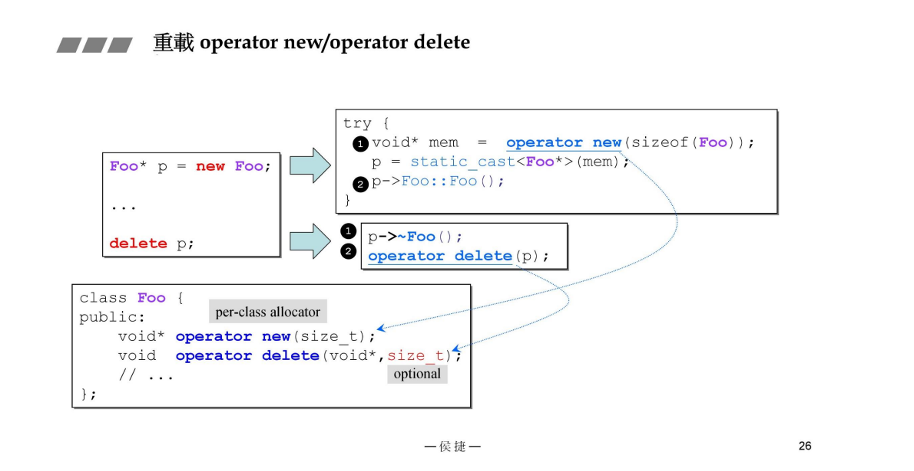
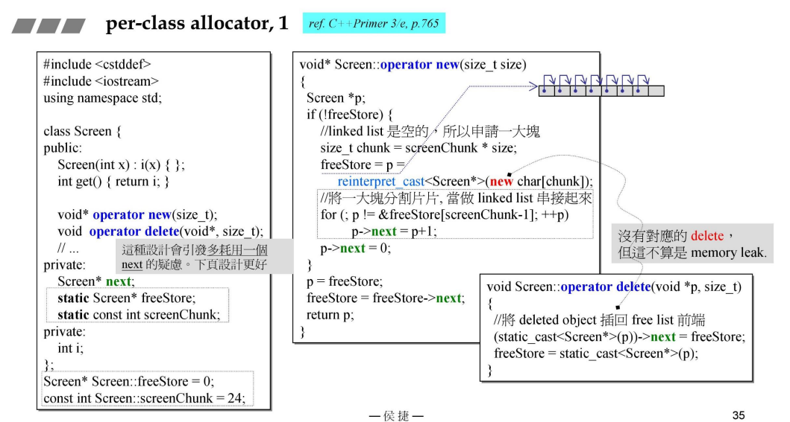
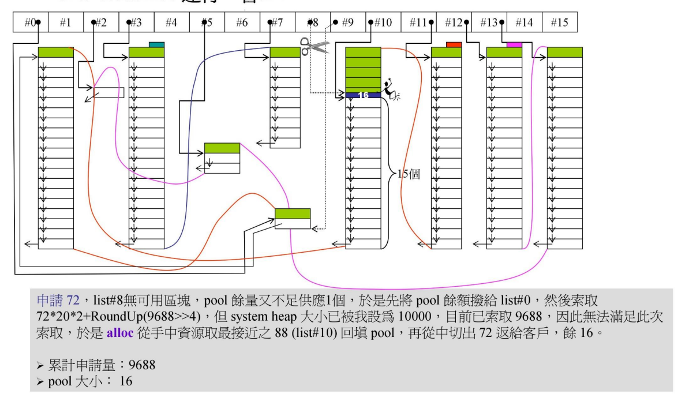
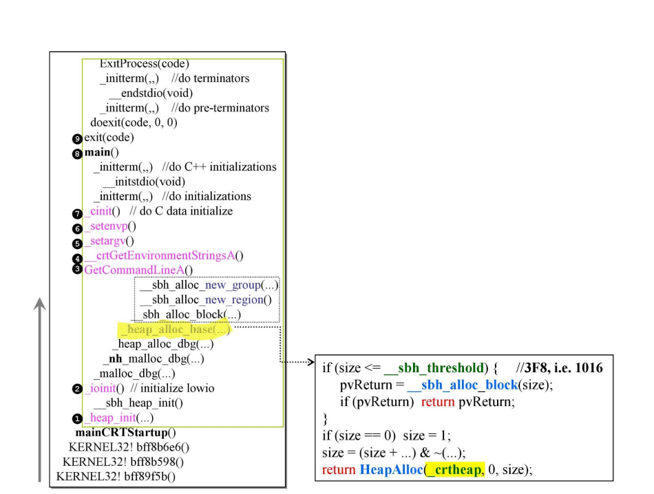

# C++内存管理从基础到复杂
> **锱铢必较 俱往矣 且看今朝**          
> --侯杰

## Prime内存组件
### c++中使用memory的途径

### C++ memory primitives

**常见用法**
```c++
    void* p1 = malloc(512);	//512 bytes
    free(p1);

    complex<int>* p2 = new complex<int>; //one object
    delete p2;             

    void* p3 = ::operator new(512); //512 bytes
    ::operator delete(p3);

//以下使用 C++ 標準庫提供的 allocators。
//其接口雖有標準規格，但實現廠商並未完全遵守；下面三者形式略異。
#ifdef _MSC_VER
    //以下兩函數都是 non-static，定要通過 object 調用。以下分配 3 個 ints.
    int* p4 = allocator<int>().allocate(3, (int*)0); //参数2无用
    allocator<int>().deallocate(p4,3);           
#endif
#ifdef __BORLANDC__
    //以下兩函數都是 non-static，定要通過 object 調用。以下分配 5 個 ints.
    int* p4 = allocator<int>().allocate(5);  
    allocator<int>().deallocate(p4,5);       
#endif
#ifdef __GNUC__
    //以下兩函數都是 static，可通過全名調用之。以下分配 512 bytes.
    //void* p4 = alloc::allocate(512); 
    //alloc::deallocate(p4,512);   
    
    //以下兩函數都是 non-static，定要通過 object 調用。以下分配 7 個 ints.    
	void* p4 = allocator<int>().allocate(7); 
    allocator<int>().deallocate((int*)p4,7);     
	
    //以下兩函數都是 non-static，定要通過 object 調用。以下分配 9 個 ints.	
	void* p5 = __gnu_cxx::__pool_alloc<int>().allocate(9); 
    __gnu_cxx::__pool_alloc<int>().deallocate((int*)p5,9);	
#endif

```
### new 表达式

可以看到new在编译器转换后的形式，
大致为：使用全局new然后再new中调用malloc如果内存不足使用callnewh，然后返回创建的内存指针，之后调用构造函数。
### delete 表达式

大致为：调用析构，然后使用delete函数触发free释放内存

### array new ，array delete

可以发现就算使用array new 缺使用 一般delete，如果类没有ptr成员也可能不会产生内存泄漏。

采用栈的结构创建和析构。
### array size，in memory

> **图中pad是为了内存对齐的填充，黄色部分是debug模式下额外内存**

在这对于int调用delete 而不是delete[]是无所谓的，因为int没有析构。

必须使用delete[]（要求demo 析构有意义）

### placement new 

placementnew 不调用maloc 直接返回已经分配内存
总的来说 placement new 就是直接再给定的位置上调用构造函数

### C++程序内存分配途径


### C++ 容器内存分配


### 重载 全局new delete

### 重载类中 new delete


其中new 和delete 最好使用static
### 示例


使用全局new delete的结果

### 重载new（）/ delete（）


**placement new 必须要有一个默认输入  size_t**


***表示在重载placement new 和placement delete 的时候只有在 new调用构造函数失败才会调用这些重载delete***


### 分配器1（per-class1）


目的减少maloc次数以用于减少cooki产生，而且让new内存在一起
美中不足的是多了一个next指针

### 分配器2（per-class2）


使用embedded pointer 嵌入式指针 也就是吧next指针当作空间使用，写入数据会覆盖他。
缺点是不free空间
### 分配器3 （static allocator）


一小块一小块的几个连续逻辑地址存储思路和上一个差不多，不用把内存分配各个版本都写一次
### 分配器4 （macro for static allocator）


### 分配器5 （global allocator）


### new handler
当operate new 无法分配出申请的内存就调用这个函数然后看情况抛出异常
newhandler 函数 一般用来申请更多内存或者（跳出循环，终止程序）


### ==default，=delete


## std::allocator 解析
### 图解总览

总体结构 使用16个链表管理不同大小数据，第一次构建一个容器都会先申请一个大小为（20*size*2 + 额外 ）的 使用malloc分配的内存，前20个用于存储数据，后20个用于作为Pool用来给之后的数据使用。因为只使用一次malloc比直接malloc少了很多cookie产生。
#### embedded pointers（嵌入式指针）

#### 第一次申请

#### 第二次申请（pool使用完）

#### 三次申请（poll=空 重新malloc）

#### 第四次（pool还有余量）

对pool分配20个88内存（如果够20个不够就不到20个）
#### 第五次（pool 不够分配 一个申请量）

pool还有但是不够分配一个申请量，剩余的pool变为碎片内存，根据大小给其他大小给到#9指针
#### 内存不够malloc情况


把pool内存根据大小给到#2指针，然后往右边寻找最近可以提供内存的指针#9（之前内存碎片归属地但是里面没有一个#9大小成员）使用#9指针内存然后自动处理内存碎片
#### 内存不够 并且没有能回填pool的时候

报错，使用后白色为使用的内存技术难度过高，对操作系统剩余内存接着申请对于多线程系统会带来灾难
### G2.9 std::alloc 源码
#### 一级分配器（先调用二级 二级失败调用一级 一级不是很重要）


#### 二级分配器

#### allocate 方法


#### deallocate方法

回收链表但是不free内存
#### refill 方法

就是用chunk_alloc申请内存然后处理嵌入式指针
#### chunk_alloc 方法


先考虑pool是否够申请20个，或者是否够申请1个以上，如果够就正常处理，剩下还是pool。不满足一个就处理碎片，当处理好碎片就malloc新内存（pool已经空），分配好的内存当作POOl然后递归调用chunk_alloc.
## maloc/free
### VC6 maloc

SBH:Small Block Heap
小于一定值就是用sbh处理，大于就直接操作系统申请内存。
### VC10 maloc

无论多大都让操作系统处理（其实操作系统也有SBH所以自己就不写了）
### heap_init() 和sbh_init()

向操作系统申请 4096大小空间，_crtheap管理，然后再使用heap_alloc 从_crtheap中申请内存,16个header.

01111是bitvCommit，0000是两个vitvEntryHi，Lo，还有两个指针，这就是一个header。
#### 总览

### _ioinit()

第一块内存申请，debug模式会有额外内存申请
### _heap_alloc_dbg()

调整大小填充debug信息cookies没写入

### _heap_alloc_base()

判断大小,小就让sbh处理,大就让操作系统处理。
### _heap_alloc_bloc()

单纯加上cookies内存然后对齐。按照16位对齐看最后一个数是否为1判断在不在掌握中。
### _sbh_alloc_new_region()

一个_sbh_header会申请一个虚拟内存并且使用 regin来管理分配内存,32GROUP，一个GROUP有64个双向指针来控制内存。
### _sbh_alloc_new_group()

通过32个group 每个group管理64个list_head 用list_head管理8个pages

#### 切割

类似的 不同大小的片段用不同的list_head管理
#### 首次分配

按照（内存/16）-1 个list管理，其中内存用virtualAlloc获得，先获得逻辑内存物理内存不一定分配（就是对饮32个group）其中每一个group也用virtualalloc获得真正内存(八个一个page4k 一共32k)，对于分配内存16位最后一位变为1代表给出去，脱离sbh控制。申请130内存，region中有一个数组表示group是否挂在内存。
#### 二次分配

分配240 先查询（内存/16）-1 的group有没有内存没有就网上找大的，找到最后一个gp，分配。其中contEntnes表示放出去内存的次数。
#### 归还

归还 240，先240h/16h = 36h归还到35list，把内存中cookies最后一位改为0，把35号list 改为1