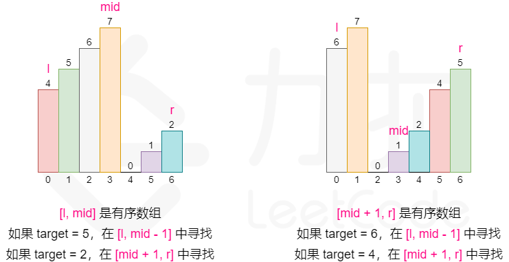

# 二分查找

这里给出两种算法。


## 左闭右闭的区间

- while (left <= right) 要使用 <= ，因为left == right是有意义的，所以使用 <=
- if (nums[middle] > target) right 要赋值为 middle - 1，因为当前这个nums[middle]一定不是target，那么接下来要查找的左区间结束下标位置就是 middle - 1

``` c++
class Solution {
public:
    int search(vector<int>& nums, int target) {
        int left = 0;
        int right = nums.size() - 1; // 定义target在左闭右闭的区间里，[left, right]
        while (left <= right) { // 当left==right，区间[left, right]依然有效，所以用 <=
            int middle = left + ((right - left) / 2);// 防止溢出 等同于(left + right)/2
            if (nums[middle] > target) {
                right = middle - 1; // target 在左区间，所以[left, middle - 1]
            } else if (nums[middle] < target) {
                left = middle + 1; // target 在右区间，所以[middle + 1, right]
            } else { // nums[middle] == target
                return middle; // 数组中找到目标值，直接返回下标
            }
        }
        // 未找到目标值
        return -1;
    }
};
```

## 左闭右开


``` c++
class Solution {
public:
    int search(vector<int>& nums, int target) {
        int left = 0;
        int right = nums.size(); // 定义target在左闭右开的区间里，即：[left, right)
        while (left < right) { // 因为left == right的时候，在[left, right)是无效的空间，所以使用 <
            int middle = left + ((right - left) >> 1);
            if (nums[middle] > target) {
                right = middle; // target 在左区间，在[left, middle)中
            } else if (nums[middle] < target) {
                left = middle + 1; // target 在右区间，在[middle + 1, right)中
            } else { // nums[middle] == target
                return middle; // 数组中找到目标值，直接返回下标
            }
        }
        // 未找到目标值
        return -1;
    }
};
```


# 74. 搜索二维矩阵
> https://leetcode.cn/problems/search-a-2d-matrix/description/?envType=study-plan-v2&envId=top-100-liked
> 
> 难度：中等
## 题目：
给你一个满足下述两条属性的 m x n 整数矩阵：

每行中的整数从左到右按非严格递增顺序排列。
每行的第一个整数大于前一行的最后一个整数。
给你一个整数 target ，如果 target 在矩阵中，返回 true ；否则，返回 false 。

 


## 示例：

输入：matrix = [[1,3,5,7],[10,11,16,20],[23,30,34,60]], target = 3
输出：true

## 分析：
把二维转换为一维搜索

## 解题1：
``` c++ 
class Solution {
public:
    pair <int ,int> getXY(int num,int mX){
        return { num%mX,num/mX};
    }

    bool searchMatrix(vector<vector<int>>& matrix, int target) {
        int maxY= matrix.size();
        int maxX= matrix[0].size();

        int l = 0, r = maxX*maxY -1;

        int mid ;

        while(l<=r){
            mid = (l+r)/2;
            auto [x,y] = getXY(mid,maxX);
            if(matrix[y][x]==target)
                return true;
            else if(matrix[y][x]<target)
                l = mid +1;
            else if(matrix[y][x]>target)
                r = mid-1;
        }

        return false;
    }
};
```

# 34. 在排序数组中查找元素的第一个和最后一个位置
> https://leetcode.cn/problems/find-first-and-last-position-of-element-in-sorted-array/description/?envType=study-plan-v2&envId=top-100-liked
> 
> 难度：中等
## 题目：
给你一个按照非递减顺序排列的整数数组 nums，和一个目标值 target。请你找出给定目标值在数组中的开始位置和结束位置。

如果数组中不存在目标值 target，返回 [-1, -1]。

你必须设计并实现时间复杂度为 O(log n) 的算法解决此问题。


## 示例：
输入：nums = [5,7,7,8,8,10], target = 8
输出：[3,4]


## 分析：
两次二分，多次判断和target相等。


## 解题1：
``` c++ 
class Solution {
public:
    vector<int> searchRange(vector<int>& nums, int target) {
        
        int first=-1,end=-1;

        int right = nums.size()-1,left = 0;
        //两次二分  先搜前 
        while(left<=right){
            int mid = (left+right)/2;
            
            if(nums[mid]==target){
                first = mid;
                right = mid -1;//重点
            }
            else if(target<nums[mid])
                right = mid-1;
            else {
                left = mid+1;
            }
        }
        right = nums.size()-1;
        left = 0;
        while(left<=right){
            int mid = (left+right)/2;
            
            if(nums[mid]==target){
                end = mid;
                left = mid +1;//重点
            }
            else if(target<nums[mid])
                right = mid-1;
            else {
                left = mid+1;
            }
        }
        return {first,end};
    }
};
```

# 33. 搜索旋转排序数组
> https://leetcode.cn/problems/search-in-rotated-sorted-array/description/?envType=study-plan-v2&envId=top-100-liked
> 
> 难度：简单
## 题目：
整数数组 nums 按升序排列，数组中的值 互不相同 。

在传递给函数之前，nums 在预先未知的某个下标 k（0 <= k < nums.length）上进行了 旋转，使数组变为 [nums[k], nums[k+1], ..., nums[n-1], nums[0], nums[1], ..., nums[k-1]]（下标 从 0 开始 计数）。例如， [0,1,2,4,5,6,7] 在下标 3 处经旋转后可能变为 [4,5,6,7,0,1,2] 。

给你 旋转后 的数组 nums 和一个整数 target ，如果 nums 中存在这个目标值 target ，则返回它的下标，否则返回 -1 。

你必须设计一个时间复杂度为 O(log n) 的算法解决此问题。


## 示例：
输入：nums = [4,5,6,7,0,1,2], target = 0
输出：4


## 分析：
主要是看mid左边有序还是右边有序就好了 注意targe == mid 的时候 还有注意边界



## 解题1：
``` c++ 
class Solution {
public:
    int search(vector<int>& nums, int target) {
        int l=0,r=nums.size()-1;
        int mid =0;

        if (r == 0) {
            return nums[0] == target ? 0 : -1;
        }

        while(l<=r){
            mid = (l+r)/2;

            if(nums[mid]==target){
                return mid;
            }

            //mid左有序
            if(nums[0]<=nums[mid]){
                
                if(nums[0]<=target&&target<nums[mid]){
                    r = mid-1;
                }else
                    l = mid+1;
            }else{//mid右有序
                
                if(nums[mid]<target&&target<=nums[nums.size()-1])
                    l = mid+1;
                else
                    r = mid-1;
            }

        }

        return -1;
    }
};
```
# 153. 寻找旋转排序数组中的最小值
> https://leetcode.cn/problems/find-minimum-in-rotated-sorted-array/description/?envType=study-plan-v2&envId=top-100-liked
> 
> 难度：中等
## 题目：
已知一个长度为 n 的数组，预先按照升序排列，经由 1 到 n 次 旋转 后，得到输入数组。例如，原数组 nums = [0,1,2,4,5,6,7] 在变化后可能得到：
若旋转 4 次，则可以得到 [4,5,6,7,0,1,2]
若旋转 7 次，则可以得到 [0,1,2,4,5,6,7]
注意，数组 [a[0], a[1], a[2], ..., a[n-1]] 旋转一次 的结果为数组 [a[n-1], a[0], a[1], a[2], ..., a[n-2]] 。

给你一个元素值 互不相同 的数组 nums ，它原来是一个升序排列的数组，并按上述情形进行了多次旋转。请你找出并返回数组中的 最小元素 。

你必须设计一个时间复杂度为 O(log n) 的算法解决此问题。


## 示例：
输入：nums = [3,4,5,1,2]
输出：1
解释：原数组为 [1,2,3,4,5] ，旋转 3 次得到输入数组。


## 分析：
和上一题一样


## 解题1：
``` c++ 
class Solution {
public:
    int findMin(vector<int>& nums) {
        int l=0,r=nums.size()-1;
        int mid,res = INT_MAX;
        while(l<=r){
            mid =(l+r)/2;
            if(nums[mid]>nums[r]){
                res = min(res,nums[mid]);
                l=mid+1;
            }
                
            else{
                res = min(res,nums[mid]);
                r=mid-1;}
        }

        return res;
    }
};
```
