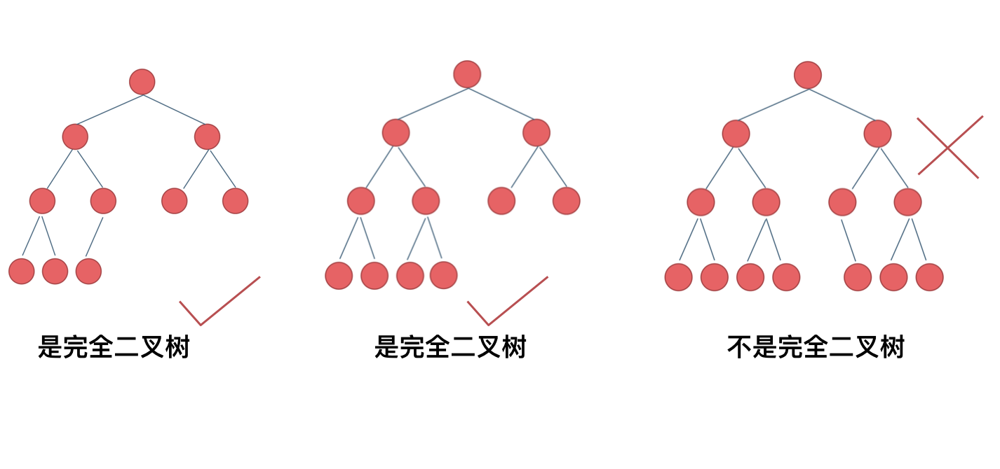
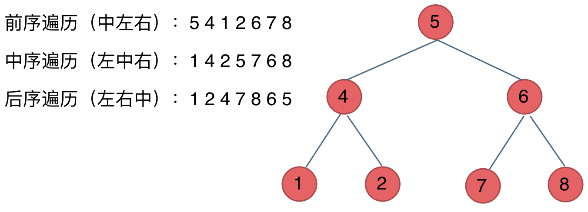

# 二叉树
二叉树分为满二叉树，完全二叉树，二叉搜索树，平衡二叉搜索树

满二叉树：如果一棵二叉树只有度为0的结点和度为2的结点，并且度为0的结点在同一层上，则这棵二叉树为满二叉树。


完全二叉树的定义如下：在完全二叉树中，除了最底层节点可能没填满外，其余每层节点数都达到最大值，并且最下面一层的节点都集中在该层最左边的若干位置。若最底层为第 h 层（h从1开始），则该层包含 1~ 2^(h-1) 个节点。


**二叉搜索树**：是一个有序树。

若它的左子树不空，则左子树上所有结点的值均小于它的根结点的值；
若它的右子树不空，则右子树上所有结点的值均大于它的根结点的值；
它的左、右子树也分别为二叉排序树


**平衡二叉搜索树**：又被称为AVL（Adelson-Velsky and Landis）树，且具有以下性质：它是一棵空树或它的左右两个子树的高度差的绝对值不超过1，并且左右两个子树都是一棵平衡二叉树。

最后一棵 不是平衡二叉树，因为它的左右两个子树的高度差的绝对值超过了1。

C++中map、set、multimap，multiset的底层实现都是平衡二叉搜索树，所以map、set的增删操作时间时间复杂度是logn，注意我这里没有说unordered_map、unordered_set，unordered_map、unordered_set底层实现是哈希表。

# 二叉树的遍历方式
**深度优先遍历**
- 前序遍历（递归法，迭代法）
- 中序遍历（递归法，迭代法）
- 后序遍历（递归法，迭代法）
  
**广度优先遍历**
- 层次遍历（迭代法）



# 递归思路

**递归三要素**
1. **确定递归函数的参数和返回值**： 确定哪些参数是递归的过程中需要处理的，那么就在递归函数里加上这个参数， 并且还要明确每次递归的返回值是什么进而确定递归函数的返回类型。

2. **确定终止条件**： 写完了递归算法, 运行的时候，经常会遇到栈溢出的错误，就是没写终止条件或者终止条件写的不对，操作系统也是用一个栈的结构来保存每一层递归的信息，如果递归没有终止，操作系统的内存栈必然就会溢出。

3. **确定单层递归的逻辑**： 确定每一层递归需要处理的信息。在这里也就会重复调用自己来实现递归的过程。

**以下以前序遍历为例：**

**确定递归函数的参数和返回值**：因为要打印出前序遍历节点的数值，所以参数里需要传入vector来放节点的数值，除了这一点就不需要再处理什么数据了也不需要有返回值，所以递归函数返回类型就是void，
代码如下：
```c++
void traversal(TreeNode* cur, vector<int>& vec)
```
**确定终止条件**：在递归的过程中，如何算是递归结束了呢，当然是当前遍历的节点是空了，那么本层递归就要结束了，所以如果当前遍历的这个节点是空，就直接return.
代码如下：
```c++
if (cur == NULL) return;
```
**确定单层递归的逻辑**：前序遍历是中左右的循序，所以在单层递归的逻辑，是要先取中节点的数值。
代码如下：
``` c++
vec.push_back(cur->val);    // 中
traversal(cur->left, vec);  // 左
traversal(cur->right, vec); // 右
```

   
``` c++
class Solution {
public:
    void traversal(TreeNode* cur, vector<int>& vec) { 
        //确定函数递归参数和返回
        if (cur == NULL) return;
        //确定函数递归逻辑
        vec.push_back(cur->val);    // 中
        traversal(cur->left, vec);  // 左
        traversal(cur->right, vec); // 右
    }
    vector<int> preorderTraversal(TreeNode* root) {
        vector<int> result;
        traversal(root, result);
        return result;
    }
};
```

# 统一的迭代思路


