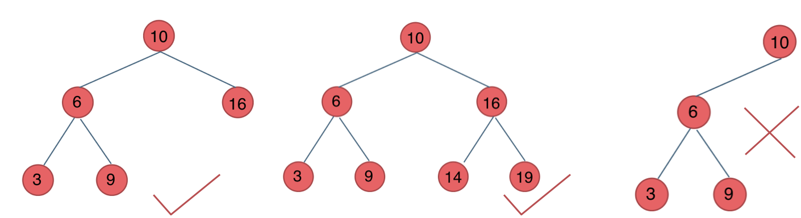
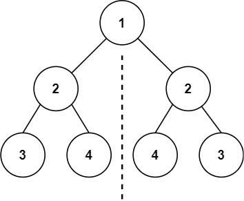
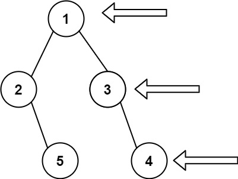
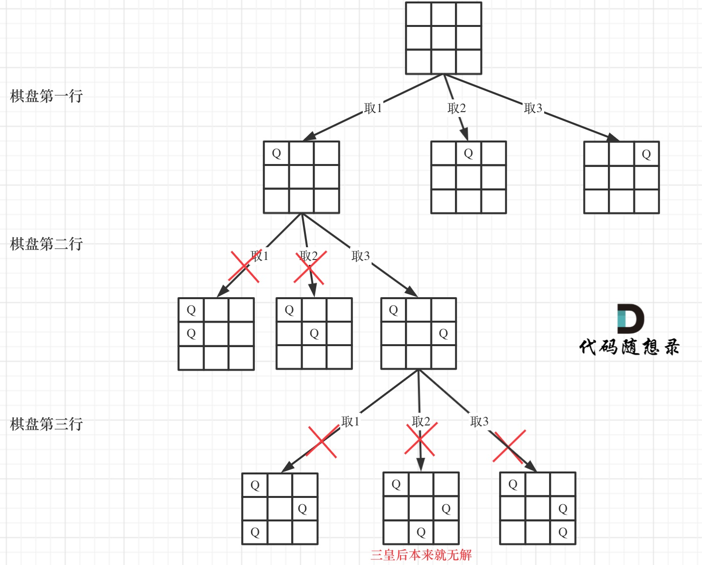

# 二叉树
二叉树分为满二叉树，完全二叉树，二叉搜索树，平衡二叉搜索树

满二叉树：如果一棵二叉树只有度为0的结点和度为2的结点，并且度为0的结点在同一层上，则这棵二叉树为满二叉树。


完全二叉树的定义如下：在完全二叉树中，除了最底层节点可能没填满外，其余每层节点数都达到最大值，并且最下面一层的节点都集中在该层最左边的若干位置。若最底层为第 h 层（h从1开始），则该层包含 1~ 2^(h-1) 个节点。


**二叉搜索树**：是一个有序树。

若它的左子树不空，则左子树上所有结点的值均小于它的根结点的值；
若它的右子树不空，则右子树上所有结点的值均大于它的根结点的值；
它的左、右子树也分别为二叉排序树


**平衡二叉搜索树**：又被称为AVL（Adelson-Velsky and Landis）树，且具有以下性质：它是一棵空树或它的左右两个子树的高度差的绝对值不超过1，并且左右两个子树都是一棵平衡二叉树。

最后一棵 不是平衡二叉树，因为它的左右两个子树的高度差的绝对值超过了1。

C++中map、set、multimap，multiset的底层实现都是平衡二叉搜索树，所以map、set的增删操作时间时间复杂度是logn，注意我这里没有说unordered_map、unordered_set，unordered_map、unordered_set底层实现是哈希表。

# 二叉树的遍历方式
**深度优先遍历**
- 前序遍历（递归法，迭代法）
- 中序遍历（递归法，迭代法）
- 后序遍历（递归法，迭代法）
  
**广度优先遍历**
- 层次遍历（迭代法）


# 递归思路

**递归三要素**
1. **确定递归函数的参数和返回值**： 确定哪些参数是递归的过程中需要处理的，那么就在递归函数里加上这个参数， 并且还要明确每次递归的返回值是什么进而确定递归函数的返回类型。

2. **确定终止条件**： 写完了递归算法, 运行的时候，经常会遇到栈溢出的错误，就是没写终止条件或者终止条件写的不对，操作系统也是用一个栈的结构来保存每一层递归的信息，如果递归没有终止，操作系统的内存栈必然就会溢出。

3. **确定单层递归的逻辑**： 确定每一层递归需要处理的信息。在这里也就会重复调用自己来实现递归的过程。

**以下以前序遍历为例：**

**确定递归函数的参数和返回值**：因为要打印出前序遍历节点的数值，所以参数里需要传入vector来放节点的数值，除了这一点就不需要再处理什么数据了也不需要有返回值，所以递归函数返回类型就是void，
代码如下：
```c++
void traversal(TreeNode* cur, vector<int>& vec)
```
**确定终止条件**：在递归的过程中，如何算是递归结束了呢，当然是当前遍历的节点是空了，那么本层递归就要结束了，所以如果当前遍历的这个节点是空，就直接return.
代码如下：
```c++
if (cur == NULL) return;
```
**确定单层递归的逻辑**：前序遍历是中左右的循序，所以在单层递归的逻辑，是要先取中节点的数值。
代码如下：
``` c++
vec.push_back(cur->val);    // 中
traversal(cur->left, vec);  // 左
traversal(cur->right, vec); // 右
```

   
``` c++
class Solution {
public:
    void traversal(TreeNode* cur, vector<int>& vec) { 
        //确定函数递归参数和返回
        if (cur == NULL) return;
        //确定函数递归逻辑
        vec.push_back(cur->val);    // 中
        traversal(cur->left, vec);  // 左
        traversal(cur->right, vec); // 右
    }
    vector<int> preorderTraversal(TreeNode* root) {
        vector<int> result;
        traversal(root, result);
        return result;
    }
};
```

# 统一的迭代思路
- 用的比较少，一般是层序遍历


# 104. 二叉树的最大深度
> https://leetcode.cn/problems/maximum-depth-of-binary-tree/description/?envType=study-plan-v2&envId=top-100-liked
> 
> 难度：简单
## 题目：
给定一个二叉树 root ，返回其最大深度。

二叉树的 最大深度 是指从根节点到最远叶子节点的最长路径上的节点数。


## 示例：

输入：root = [3,9,20,null,null,15,7]
输出：3


## 分析：
没什么好分析的直接看代码


## 解题1：
``` c++ 
class Solution {
public:
    int maxDepth(TreeNode* root) {
        if(root ==nullptr)
            return 0;
        
        return max(maxDepth(root->left),maxDepth(root->right))+1;
    }
};
```


# 226. 翻转二叉树
> https://leetcode.cn/problems/invert-binary-tree/description/?envType=study-plan-v2&envId=top-100-liked
> 
> 难度：简单
## 题目：
给你一棵二叉树的根节点 root ，翻转这棵二叉树，并返回其根节点。


## 示例：


## 分析：
使用前序遍历，处理中间节点，依次交换节点(中 前 后，到中间节点代表数据对换) 


## 解题1：
``` c++ 
class Solution {
public:
    TreeNode* invertTree(TreeNode* root) {
        if(root ==nullptr) return nullptr ;

        swap(root->left,root->right);
        invertTree(root->left);
        invertTree(root->right);

        return root;
    }
};
```
  
# 101. 对称二叉树
> 
> https://leetcode.cn/problems/symmetric-tree/description/?envType=study-plan-v2&envId=top-100-liked
> 难度：简单
## 题目：
给你一个二叉树的根节点 root ， 检查它是否轴对称。


## 示例：

输入：root = [1,2,2,3,4,4,3]
输出：true


## 分析：
首先必须是有左右节点而且数值相同才会接着比较，然后就是 L->L R->R 比较。


## 解题1：
``` c++ 
class Solution {
public:
    bool compareNode(TreeNode* left,TreeNode *right){
        if(left == nullptr&& right == nullptr) return true;
        else if(left == nullptr && right !=nullptr) return false;
        else if(left != nullptr && right ==nullptr)return false;
        else if(left ->val != right->val) return false;

        bool outSide = compareNode(left->left,right->right);
        bool inSide = compareNode(left->right,right->left);

        return outSide && inSide;
    }

    bool isSymmetric(TreeNode* root) {
        if(!root) return false;
        
        return compareNode(root->left,root->right);
    }
};

```

# 543. 二叉树的直径
> https://leetcode.cn/problems/diameter-of-binary-tree/description/?envType=study-plan-v2&envId=top-100-liked
> 
> 难度：简单
## 题目：
给你一棵二叉树的根节点，返回该树的 直径 。

二叉树的 直径 是指树中任意两个节点之间最长路径的 长度 。这条路径可能经过也可能不经过根节点 root 。

两节点之间路径的 长度 由它们之间边数表示。


## 示例：

输入：root = [1,2,3,4,5]
输出：3
解释：3 ，取路径 [4,2,1,3] 或 [5,2,1,3] 的长度。

## 分析：
首先我们知道一条路径的长度为该路径经过的节点数减一，所以求直径（即求路径长度的最大值）等效于求路径经过节点数的最大值减一。

在代码中 每一个节点 的L+R+1表示以经过这个节点的最长路径（节点数）


## 解题1：
``` c++ 
class Solution {
public:

    int depth(TreeNode *root,int &res){
        if(root==nullptr)
            return 0;
        int L = depth(root->left,res);
        int R = depth(root->right,res);
        res = max(res,L+R+1);

        return max(L,R)+1;
    }

    int diameterOfBinaryTree(TreeNode* root) {
        int res = 0;
        depth(root,res);
        return res-1;//要-1因为要求的是直径
    }
};
```

# 102. 二叉树的层序遍历

> https://leetcode.cn/problems/binary-tree-level-order-traversal/description/?envType=study-plan-v2&envId=top-100-liked
> 
> 难度：中等
## 题目：
给你二叉树的根节点 root ，返回其节点值的 层序遍历 。 （即逐层地，从左到右访问所有节点）。


## 示例：

输入：root = [3,9,20,null,null,15,7]
输出：[[3],[9,20],[15,7]]

## 分析：
利用队列先进先出。前序遍历顺序


## 解题1：
``` c++ 
class Solution {
public:
    vector<vector<int>> levelOrder(TreeNode* root) {
        queue<TreeNode*> que;
        if(root !=nullptr) que.push(root);
        vector<vector<int>> result;

        while(!que.empty()){
            int size = que.size();
            vector<int> res;
            for(int i=0;i<size;i++){
                TreeNode *node = que.front();
                que.pop();
                res.push_back(node->val);

                if (node->left) que.push(node->left);
                if (node->right) que.push(node->right);
                
            }
            result.push_back(res);
        }

        return result;
    }
};
```

# 108. 将有序数组转换为二叉搜索树
> 
> https://leetcode.cn/problems/convert-sorted-array-to-binary-search-tree/description/?envType=study-plan-v2&envId=top-100-liked
> 难度：简单
## 题目：
给你一个整数数组 nums ，其中元素已经按 升序 排列，请你将其转换为一棵 高度平衡 二叉搜索树。

高度平衡 二叉树是一棵满足「每个节点的左右两个子树的高度差的绝对值不超过 1 」的二叉树。

 


## 示例：

输入：nums = [-10,-3,0,5,9]
输出：[0,-3,9,-10,null,5]
解释：[0,-10,5,null,-3,null,9] 也将被视为正确答案：

## 分析：
类似二分查找的思路找到中间节点然后 划分左右
这里int mid = left + ((right - left) / 2);的写法相当于是如果数组长度为偶数，中间位置有两个元素，取靠左边的。

## 解题1：
``` c++ 
class Solution {
private:
    TreeNode* traversal(vector<int>& nums, int left, int right) {
        if (left > right) return nullptr;
        int mid = left + ((right - left) / 2);
        TreeNode* root = new TreeNode(nums[mid]);
        root->left = traversal(nums, left, mid - 1);
        root->right = traversal(nums, mid + 1, right);
        return root;
    }
public:
    TreeNode* sortedArrayToBST(vector<int>& nums) {
        TreeNode* root = traversal(nums, 0, nums.size() - 1);
        return root;
    }
};
```

# 98. 验证二叉搜索树
> https://leetcode.cn/problems/validate-binary-search-tree/description/?envType=study-plan-v2&envId=top-100-liked
> 
> 难度：简单
## 题目：
给你一个二叉树的根节点 root ，判断其是否是一个有效的二叉搜索树。

有效 二叉搜索树定义如下：

节点的左子树只包含 小于 当前节点的数。
节点的右子树只包含 大于 当前节点的数。
所有左子树和右子树自身必须也是二叉搜索树。


## 示例：

输入：root = [5,1,4,null,null,3,6]
输出：false
解释：根节点的值是 5 ，但是右子节点的值是 4 。

## 分析：
中序遍历 后一个个比较大小 秒了


## 解题1：
``` c++ 
class Solution {
public:
    vector<int> vec;

    void travelNode(TreeNode* root){
        if(root ==nullptr) return ;

        travelNode(root->left);
        vec.push_back(root->val);
        travelNode(root->right);
    }

    bool isValidBST(TreeNode* root) {
        
        travelNode(root);
        if(vec.size()<=1){
            return true;
        }
        else{
            for(int i =1;i<vec.size();i++){
                if (vec[i] <= vec[i - 1]) return false;
            }
        }
        return true;
    }
};
```

# 230. 二叉搜索树中第K小的元素
> https://leetcode.cn/problems/kth-smallest-element-in-a-bst/description/?envType=study-plan-v2&envId=top-100-liked
> 
> 难度：中等
## 题目：
给定一个二叉搜索树的根节点 root ，和一个整数 k ，请你设计一个算法查找其中第 k 个最小元素（从 1 开始计数）。
## 分析：
中序遍历 然后输出倒数k个，秒了


## 解题1：
和上一题差不多不写了


# 199. 二叉树的右视图
> 
> https://leetcode.cn/problems/binary-tree-right-side-view/description/?envType=study-plan-v2&envId=top-100-liked
> 难度：中等
## 题目：
给定一个二叉树的 根节点 root，想象自己站在它的右侧，按照从顶部到底部的顺序，返回从右侧所能看到的节点值。


## 示例：

输入: [1,2,3,null,5,null,4]
输出: [1,3,4]

## 分析：
中前后的遍历数组前几个是 左试图，所以用 中 后 前 的顺序 那么前几个就是右试图


## 解题1：
``` c++ 
class Solution {
public:

    vector<int> vec ;

    void dfs(TreeNode *root,int depth){
        if(root == nullptr)
            return;
        if(depth==vec.size())
            vec.push_back(root->val);
        dfs(root->right,depth+1);
        dfs(root->left ,depth+1);
    }

    vector<int> rightSideView(TreeNode* root) {
        vec.clear();
        dfs(root ,0);
        return vec;
    }
};
```

# 236. 二叉树的最近公共祖先
> https://leetcode.cn/problems/lowest-common-ancestor-of-a-binary-tree/description/?envType=study-plan-v2&envId=top-100-liked
> 
> 难度：简单
## 题目：
给定一个二叉树, 找到该树中两个指定节点的最近公共祖先。

百度百科中最近公共祖先的定义为：“对于有根树 T 的两个节点 p、q，最近公共祖先表示为一个节点 x，满足 x 是 p、q 的祖先且 x 的深度尽可能大（一个节点也可以是它自己的祖先）。”


## 示例：

输入：root = [3,5,1,6,2,0,8,null,null,7,4], p = 5, q = 1
输出：3
解释：节点 5 和节点 1 的最近公共祖先是节点 3 。

## 分析：
考虑通过递归对二叉树进行先序遍历，当遇到节点 ppp 或 qqq 时返回。从底至顶回溯，当节点 p,qp, qp,q 在节点 rootrootroot 的异侧时，节点 rootrootroot 即为最近公共祖先，则向上返回 rootrootroot 。


## 解题1：
``` c++ 
class Solution {
public:
    TreeNode* lowestCommonAncestor(TreeNode* root, TreeNode* p, TreeNode* q) {
        if(root ==nullptr ||root == p|| root ==q){
            return root;
        }

        TreeNode *left = lowestCommonAncestor(root->left,p,q);
        TreeNode *right = lowestCommonAncestor(root->right,p,q);

        if(left ==nullptr) return right;
        if(right ==nullptr) return left;

        return root;
    }
};
```

# 437. 路径总和 III
> https://leetcode.cn/problems/path-sum-iii/description/?envType=study-plan-v2&envId=top-100-liked
> 
> 难度：中等
## 题目：
给定一个二叉树的根节点 root ，和一个整数 targetSum ，求该二叉树里节点值之和等于 targetSum 的 路径 的数目。

路径 不需要从根节点开始，也不需要在叶子节点结束，但是路径方向必须是向下的（只能从父节点到子节点）。


## 示例：

输入：root = [10,5,-3,3,2,null,11,3,-2,null,1], targetSum = 8
输出：3
解释：和等于 8 的路径有 3 条，如图所示。

## 分析：
双重dfs 注意long 换int


## 解题1：
``` c++ 
class Solution {
public:
    int rootSum(TreeNode* root, long targetSum) {
        if (!root) {
            return 0;
        }

        int ret = 0;
        if (root->val == targetSum) {
            ret++;
        } 

        ret += rootSum(root->left, targetSum - root->val);
        ret += rootSum(root->right, targetSum - root->val);
        return ret;
    }

    int pathSum(TreeNode* root, int targetSum) {
        if (!root) {
            return 0;
        }
        
        int ret = rootSum(root, targetSum);
        ret += pathSum(root->left, targetSum);
        ret += pathSum(root->right, targetSum);
        return ret;
    }
};

```

# 124. 二叉树中的最大路径和
> 
> https://leetcode.cn/problems/binary-tree-maximum-path-sum/description/?envType=study-plan-v2&envId=top-100-liked
> 难度：困难
## 题目：
二叉树中的 路径 被定义为一条节点序列，序列中每对相邻节点之间都存在一条边。同一个节点在一条路径序列中 至多出现一次 。该路径 至少包含一个 节点，且不一定经过根节点。

路径和 是路径中各节点值的总和。

给你一个二叉树的根节点 root ，返回其 最大路径和 。


## 示例：


输入：root = [1,2,3]
输出：6
解释：最优路径是 2 -> 1 -> 3 ，路径和为 2 + 1 + 3 = 6
## 分析：
先拆解成小问题对于一个有左右节点的二叉树来说，求最大路径和，就是看 max(父+左,父+右)
 
## 解题1：
``` c++ 
class Solution {
private:
    int maxSum = INT_MIN;

public:
    int maxGain(TreeNode* node) {
        if (node == nullptr) {
            return 0;
        }
        
        // 递归计算左右子节点的最大贡献值
        // 只有在最大贡献值大于 0 时，才会选取对应子节点
        int leftGain = max(maxGain(node->left), 0);
        int rightGain = max(maxGain(node->right), 0);

        // 节点的最大路径和取决于该节点的值与该节点的左右子节点的最大贡献值
        int priceNewpath = node->val + leftGain + rightGain;

        // 更新答案
        maxSum = max(maxSum, priceNewpath);

        // 返回节点的最大贡献值
        return node->val + max(leftGain, rightGain);
    }

    int maxPathSum(TreeNode* root) {
        maxGain(root);
        return maxSum;
    }
};
```

# 51. N 皇后
> https://leetcode.cn/problems/n-queens/description/?envType=study-plan-v2&envId=top-100-liked
> 
> 难度：困难
## 题目：
按照国际象棋的规则，皇后可以攻击与之处在同一行或同一列或同一斜线上的棋子。

n 皇后问题 研究的是如何将 n 个皇后放置在 n×n 的棋盘上，并且使皇后彼此之间不能相互攻击。

给你一个整数 n ，返回所有不同的 n 皇后问题 的解决方案。

每一种解法包含一个不同的 n 皇后问题 的棋子放置方案，该方案中 'Q' 和 '.' 分别代表了皇后和空位。


## 示例：

输入：n = 4
输出：[ [".Q..","...Q","Q...","..Q."],["..Q.","Q...","...Q",".Q.."]]
解释：如上图所示，4 皇后问题存在两个不同的解法。


## 分析：
按照y来遍历，注意棋盘初始化，保证[y][x]能放的情况下 下棋


## 解题1：
``` c++ 
class Solution {
public:
    vector<vector<string>> res;

    bool isTrue(vector<string>& board,int x,int y,int n){
        for(int i=0;i<y;i++){
            if(board[i][x] =='Q')
                return false;
        }

        for(int X = x-1, Y =y-1;X>=0&&Y>=0;X--,Y--){
            if(board[Y][X] =='Q')
                return false;
        }

        for(int X = x+1, Y =y-1;X<n&&Y>=0;X++,Y--){
            if(board[Y][X] =='Q')
                return false;
        }

        return true;
    }

    void backTracking(vector<string>& board,int y,int n){
        if(y==n){
            res.push_back(board);
            return;
        }
        for(int x=0;x<n;x++){
            if(isTrue(board,x,y,n)){
                board[y][x] = 'Q';
                backTracking(board,y+1,n);
                board[y][x] = '.';
            }
        }
    }

    vector<vector<string>> solveNQueens(int n) {
        res.clear();
        vector<string> board(n,string(n,'.'));
        backTracking(board,0,n);
        return res;
    }
};
```
