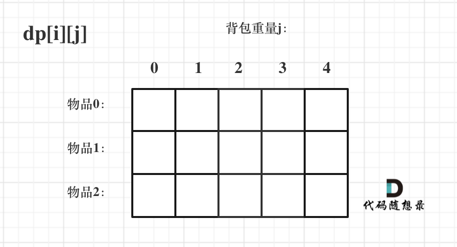
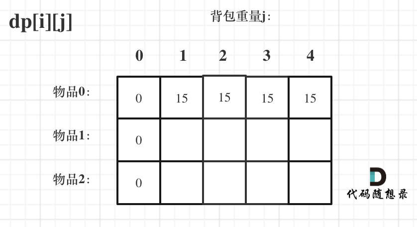
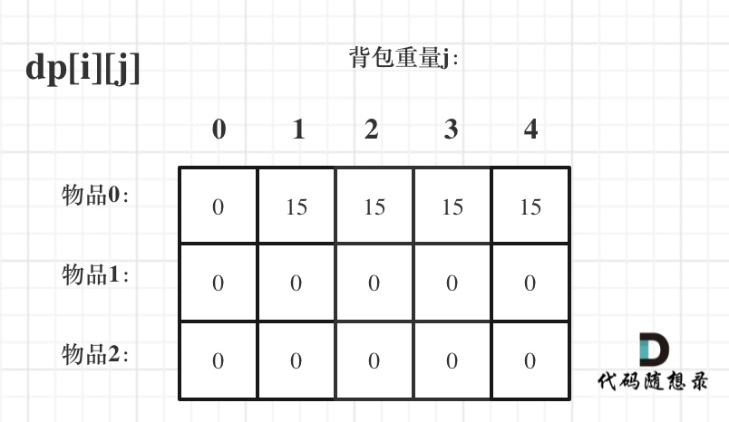
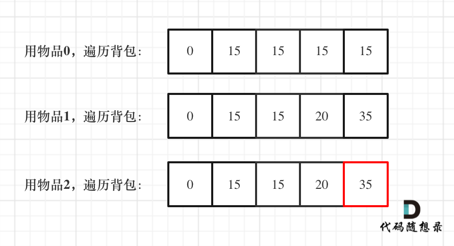

# 动态规划

有点像贪心，但是动态规划中每一个状态一定是由上一个状态推导出来的，这一点就区分于贪心，贪心没有状态推导，而是从局部直接选最优的。

**例如 : 有N件物品和一个最多能背重量为W 的背包。第i件物品的重量是weight[i]，得到的价值是value[i] 。每件物品只能用一次，求解将哪些物品装入背包里物品价值总和最大。**

动态规划中dp[j]是由dp[j-weight[i]]推导出来的，然后取max(dp[j], dp[j - weight[i]] + value[i])。

但如果是贪心呢，每次拿物品选一个最大的或者最小的就完事了，和上一个状态没有关系。

所以贪心解决不了动态规划的问题。

## 解题步骤
- 确定dp数组（dp table）以及下标的含义
- 确定递推公式
- dp数组如何初始化
- 确定遍历顺序
- 举例推导dp数组
  
# 70. 爬楼梯
> https://leetcode.cn/problems/climbing-stairs/
> 
> 难度：简单
## 题目：
假设你正在爬楼梯。需要 n 阶你才能到达楼顶。

每次你可以爬 1 或 2 个台阶。你有多少种不同的方法可以爬到楼顶呢？

注意：给定 n 是一个正整数。


## 示例：
输入： 3
输出： 3
解释： 有三种方法可以爬到楼顶。
1 阶 + 1 阶 + 1 阶
1 阶 + 2 阶
2 阶 + 1 阶
#算法公开课


## 分析：
dp[i]  = dp[i-1] + dp[i-2];
## 解题1：
``` c++ 
class Solution {
public:
    int climbStairs(int n) {
        
        int dp[3];
        dp[0] = 0;
        dp[1] = 1;
        dp[2] = 2;
        if (n <= 2) return dp[n];
        for(int i=3;i<=n;i++){
            int sum = dp[1]+dp[2];
            dp[1] = dp[2];
            dp[2] = sum;
        }
        return dp[2];
    }
};
```

# 118. 杨辉三角
> https://leetcode.cn/problems/pascals-triangle/description/?envType=study-plan-v2&envId=top-100-liked
> 
> 难度：简单
## 题目：
给定一个非负整数 numRows，生成「杨辉三角」的前 numRows 行。

在「杨辉三角」中，每个数是它左上方和右上方的数的和。


## 示例：
输入: numRows = 5
输出: [[1],[1,1],[1,2,1],[1,3,3,1],[1,4,6,4,1]]


## 分析：

其实就是 中间的数值等于 上边左边和右边的和；

## 解题1：
``` c++ 
class Solution {
public:
    vector<vector<int>> generate(int numRows) {
        vector<vector<int>> res;
        res.clear();
        for(int i=0;i<numRows;i++){
            vector<int> vec(i+1);
       
            for(int j =0; j<=i;j++){
                if(j==0||j==i){
                    vec[j] = 1;
                }else{
                    vec[j] = res[i-1][j-1]+res[i-1][j];
                }
            }
            res.push_back(vec);
        }
        return res;
    }
};
```

# 198. 打家劫舍
> 
> https://leetcode.cn/problems/house-robber/description/?envType=study-plan-v2&envId=top-100-liked
> 难度：中等
## 题目：
你是一个专业的小偷，计划偷窃沿街的房屋。每间房内都藏有一定的现金，影响你偷窃的唯一制约因素就是相邻的房屋装有相互连通的防盗系统，如果两间相邻的房屋在同一晚上被小偷闯入，系统会自动报警。

给定一个代表每个房屋存放金额的非负整数数组，计算你 不触动警报装置的情况下 ，一夜之内能够偷窃到的最高金额。


## 示例：
输入：[1,2,3,1]
输出：4
解释：偷窃 1 号房屋 (金额 = 1) ，然后偷窃 3 号房屋 (金额 = 3)。
     偷窃到的最高金额 = 1 + 3 = 4 。


## 分析：

判断dp数组 ： dp[i]代表 到 i 取的最大价值 
所以  dp[i] = max(dp[i-1],dp[i-2]+nums[i]);
size 0 1 特殊判断

## 解题1：
``` c++ 
class Solution {
public:
    int rob(vector<int>& nums) {
        //dp[i] 表示到i所偷的最大值
        vector<int> dp(nums.size());

        if(nums.size()==0) return 0;
        if(nums.size()==1) return nums[0];

        dp[0] = nums[0];
        dp[1] = max(dp[0],nums[1]);

       for(int i=2;i<nums.size();i++){
        dp[i] = max(dp[i-1],dp[i-2]+nums[i]);
       }

        return dp[nums.size()-1];

    }
};
```

# 01背包
有n件物品和一个最多能背重量为w 的背包。第i件物品的重量是weight[i]，得到的价值是value[i] 。每件物品只能用一次，求解将哪些物品装入背包里物品价值总和最大。
## 二维数组dp 01背包

**按照解题步骤**
 - **确定dp数组含义** 

即dp[i][j] 表示从下标为[0-i]的物品里任意取，放进容量为j的背包，价值总和最大是多少。

- **确定递推公式**
dp[i][j] = max(dp[i - 1][j], dp[i - 1][j - weight[i]] +value[i]);
  - dp[i - 1][j] 代表不放物品i 
  - dp[i - 1][j - weight[i]] + value[i]代表放物品 i。

- **初始化dp数组**
  

``` c++
for (int j = 0 ; j < weight[0]; j++) {  // 当然这一步，如果把dp数组预先初始化为0了，这一步就可以省略，但很多同学应该没有想清楚这一点。
    dp[0][j] = 0;
}
// 正序遍历
for (int j = weight[0]; j <= bagweight; j++) {
    dp[0][j] = value[0];
}
```

简化后代码 
``` c++
vector<vector<int>> dp(weight.size(), vector<int>(bagweight + 1, 0));
for (int j = weight[0]; j <= bagweight; j++) {
    dp[0][j] = value[0];
}
```


- **确定遍历顺序**
  建议先物品后容量（因为转换为一维dp时也是这个顺序）
  两个for可以对调 逻辑不变 
``` c++
// weight数组的大小 就是物品个数 c  两个for可以对调 逻辑不变
for(int i = 1; i < weight.size(); i++) { // 遍历物品
    for(int j = 0; j <= bagweight; j++) { // 遍历背包容量
        if (j < weight[i]) dp[i][j] = dp[i - 1][j];
        else dp[i][j] = max(dp[i - 1][j], dp[i - 1][j - weight[i]] + value[i]);

    }
}
```
## 一维数组dp 01背包
只能先物品 再背包，而且背包要倒叙（正序会导致物品多次放入）

``` c++
void test_1_wei_bag_problem() {
    vector<int> weight = {1, 3, 4};
    vector<int> value = {15, 20, 30};
    int bagWeight = 4;

    // 初始化
    vector<int> dp(bagWeight + 1, 0);
    for(int i = 0; i < weight.size(); i++) { // 遍历物品
        for(int j = bagWeight; j >= weight[i]; j--) { // 遍历背包容量
            dp[j] = max(dp[j], dp[j - weight[i]] + value[i]);
        }
    }
    cout << dp[bagWeight] << endl;
}

int main() {
    test_1_wei_bag_problem();
}
```

# 完全背包 
完全背包和01背包问题唯一不同的地方就是，每种物品有无限件。

代码大致和01一样就是遍历重量从小到大（大到小 物品不重复，小到大物品可重复）
``` c++
void test_CompletePack() {
    vector<int> weight = {1, 3, 4};
    vector<int> value = {15, 20, 30};
    int bagWeight = 4;
    vector<int> dp(bagWeight + 1, 0);
    for(int i = 0; i < weight.size(); i++) { // 遍历物品
        for(int j = weight[i]; j <= bagWeight; j++) { // 遍历背包容量 
        //和 01背包唯一不同在这 容量从小到大 因为物品可以重复
            dp[j] = max(dp[j], dp[j - weight[i]] + value[i]);
        }
    }
    cout << dp[bagWeight] << endl;
}
int main() {
    test_CompletePack();
}
```

# 279. 完全平方数
> https://leetcode.cn/problems/perfect-squares/description/?envType=study-plan-v2&envId=top-100-liked
> 
> 难度：中等
## 题目：
给你一个整数 n ，返回 和为 n 的完全平方数的最少数量 。

完全平方数 是一个整数，其值等于另一个整数的平方；换句话说，其值等于一个整数自乘的积。例如，1、4、9 和 16 都是完全平方数，而 3 和 11 不是。


## 示例：
输入：n = 12
输出：3 
解释：12 = 4 + 4 + 4


## 分析：
完全背包
确定dp[j] 表示和为j的最小完美数和
dp[j] = min(dp[j - i * i] + 1, dp[j]);
        取 i*i，和不取 i *i；
注意初始化dpp[0]= 0;其他的为int_ax
## 解题1：
``` c++ 
class Solution {
public:
    int numSquares(int n) {
        vector<int> dp(n + 1, INT_MAX);
        dp[0] = 0;
        for (int i = 1; i * i <= n; i++) { // 遍历物品
            for (int j = i * i; j <= n; j++) { // 遍历背包
                dp[j] = min(dp[j - i * i] + 1, dp[j]);
            }
        }
        return dp[n];
    }
};
```


# 322. 零钱兑换
> https://leetcode.cn/problems/coin-change/description/?envType=study-plan-v2&envId=top-100-liked
> 
> 难度：中等
## 题目：
给你一个整数数组 coins ，表示不同面额的硬币；以及一个整数 amount ，表示总金额。

计算并返回可以凑成总金额所需的 最少的硬币个数 。如果没有任何一种硬币组合能组成总金额，返回 -1 。

你可以认为每种硬币的数量是无限的。


## 示例：
输入：coins = [1, 2, 5], amount = 11
输出：3 
解释：11 = 5 + 5 + 1


## 分析：
dp[j] 为 金额为j的最小组合
dp[j] = (dp[j-nums[i]]+1,dp[j])


## 解题1：
``` c++ 
class Solution {
public:
    int coinChange(vector<int>& coins, int amount) {
        vector<int> dp(amount+1,INT_MAX);
        dp[0] = 0;
        for(int i=0;i<coins.size();i++){
            for(int j=coins[i];j<=amount;j++){
                if(dp[j-coins[i]]!=INT_MAX)//为初始说明无法组成
                    dp[j] = min(dp[j-coins[i]]+1,dp[j]);
            }
        }

        return dp[amount]==INT_MAX?-1:dp[amount];
    }
};
```