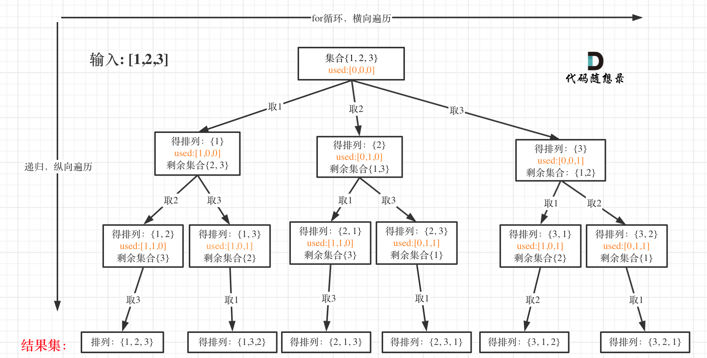
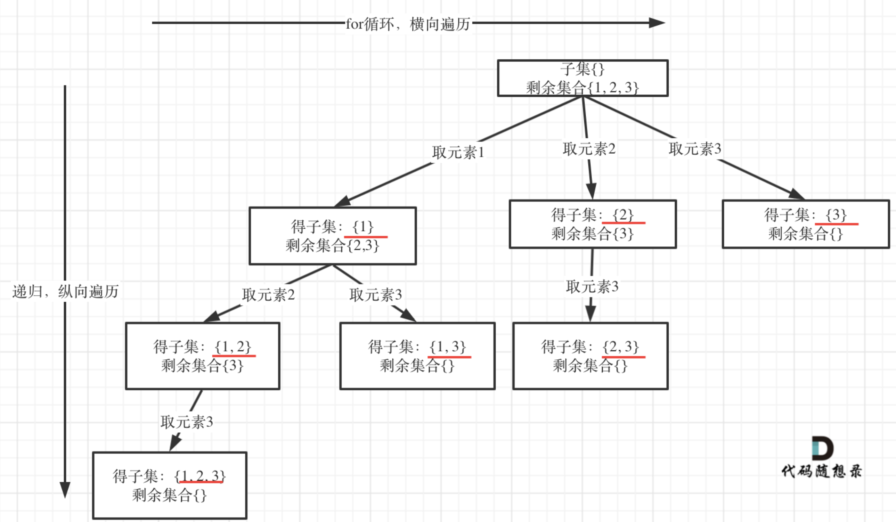
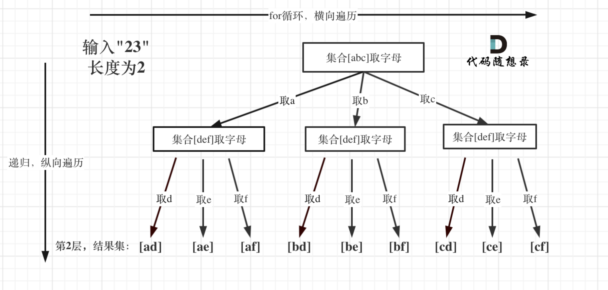
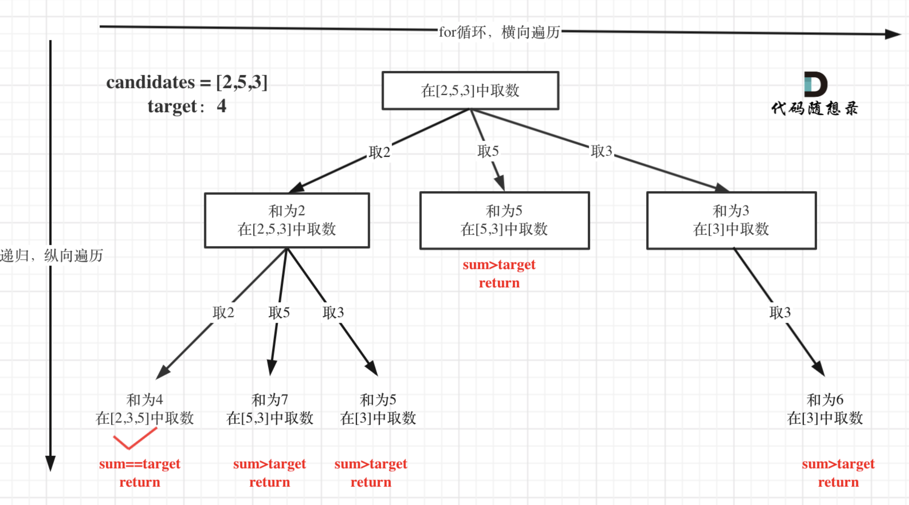
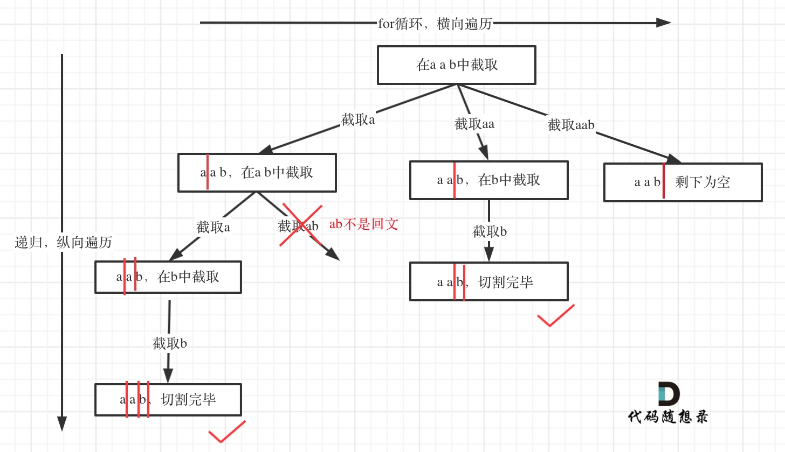
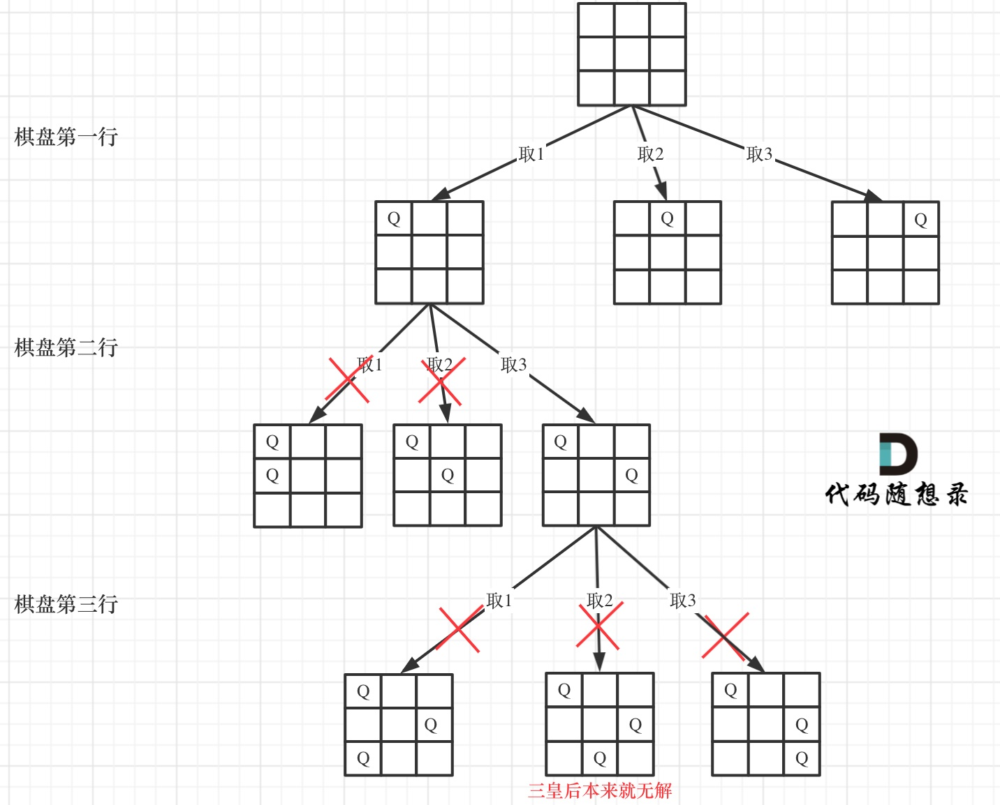

## 回溯

 回溯法，一般可以解决如下几种问题：

- 组合问题：N个数里面按一定规则找出k个数的集合
- 切割问题：一个字符串按一定规则有几种切割方式
- 子集问题：一个N个数的集合里有多少符合条件的子集
- 排列问题：N个数按一定规则全排列，有几种排列方式
- 棋盘问题：N皇后，解数独等等

#回溯模板

-  **确定回溯函数模板返回值以及参数，般是先写逻辑，然后需要什么参数，就填什么参数**

``` c++
void backtracking(参数)
```

- **回溯函数终止条件**
``` c++
if (终止条件) {
    存放结果;
    return;
}
```
- **回溯搜索的遍历过程**
  


``` c++
for (选择：本层集合中元素（树中节点孩子的数量就是集合的大小）) {
    处理节点;
    backtracking(路径，选择列表); // 递归
    回溯，撤销处理结果
}
```

- **总结模板**

``` c++
void backtracking(参数) {
    if (终止条件) {
        存放结果;
        return;
    }

    for (选择：本层集合中元素（树中节点孩子的数量就是集合的大小）) {
        处理节点;
        backtracking(路径，选择列表); // 递归
        回溯，撤销处理结果
    }
}
```


# 46. 全排列

> https://leetcode.cn/problems/permutations/description/?envType=study-plan-v2&envId=top-100-liked
> 
> 难度：中等
## 题目：
给定一个不含重复数字的数组 nums ，返回其 所有可能的全排列 。你可以 按任意顺序 返回答案。


## 示例：
输入：nums = [1,2,3]
输出：[[1,2,3],[1,3,2],[2,1,3],[2,3,1],[3,1,2],[3,2,1]]


## 分析：
经典的排列问题



## 解题1：
``` c++ 
class Solution {
public:
    vector<int> path;
    vector<vector<int>> res;
    vector<bool> used;
    void backtracking(vector<int> nums,vector<bool> used){
        if(path.size()==nums.size()){
            res.push_back(path);
            return;
        }
        for(int i=0;i<nums.size();i++){
            if(used[i])continue;
            used[i] = true;
            path.push_back(nums[i]);
            backtracking(nums,used);
            //撤销
            path.pop_back();
            used[i] = false;
        }
    }


    vector<vector<int>> permute(vector<int>& nums) {
        used.clear();
        res.clear();
        vector<bool> used(nums.size(), false);
        backtracking(nums,used);

        return res;
    }
};
```

# 78. 子集
> https://leetcode.cn/problems/subsets/description/?envType=study-plan-v2&envId=top-100-liked
> 
> 难度：中等
## 题目：
给你一个整数数组 nums ，数组中的元素 互不相同 。返回该数组所有可能的
子集
（幂集）。

解集 不能 包含重复的子集。你可以按 任意顺序 返回解集。


## 示例：
输入：nums = [1,2,3]
输出：[ [],[1],[2],[1,2],[3],[1,3],[2,3],[1,2,3]]


## 分析：



## 解题1：
``` c++ 
class Solution {
public:
    vector<vector<int>> result;
    vector<int> path;

    void backtracking(vector<int>& nums, int startIndex) {
        result.push_back(path);
        if (startIndex>=nums.size()) {
            return;
        }
        for (int i =startIndex;i<nums.size();i++) {
            path.push_back(nums[i]);
            backtracking(nums,i+1); // 递归
            path.pop_back();
        }
}

    vector<vector<int>> subsets(vector<int>& nums) {
        result.clear();
        path.clear();
        backtracking(nums, 0);
        return result;
    }
};
```

# 17. 电话号码的字母组合
> 
> https://leetcode.cn/problems/letter-combinations-of-a-phone-number/description/?envType=study-plan-v2&envId=top-100-liked
> 难度：中等
## 题目：
给定一个仅包含数字 2-9 的字符串，返回所有它能表示的字母组合。答案可以按 任意顺序 返回。

给出数字到字母的映射如下（与电话按键相同）。注意 1 不对应任何字母。


## 示例：

输入：digits = "23"
输出：["ad","ae","af","bd","be","bf","cd","ce","cf"]

## 分析：



## 解题1：
``` c++ 
class Solution {
public:
const string letterMap[10] = {
            "", // 0
            "", // 1
            "abc", // 2
            "def", // 3
            "ghi", // 4
            "jkl", // 5
            "mno", // 6
            "pqrs", // 7
            "tuv", // 8
            "wxyz", // 9
        };
    vector<string> res;
    string s; 
    void backTracking(string &str,int index){
        if(index>=str.size()){
            res.push_back(s);
            return;
        }

        int s_index = str[index] -'0';
  

        for(int i=0;i<letterMap[s_index].size();i++){
            s.push_back(letterMap[s_index][i]);          // 处理
            backTracking(str, index + 1);    // 递归，注意index+1，一下层要处理下一个数字了
            s.pop_back();   
        }
    }

    vector<string> letterCombinations(string digits) {
        s.clear();
        res.clear();
        if(digits.size()==0)
            return res;
        backTracking(digits,0);

        return res;
    }
};
```


# 39. 组合总和
> https://leetcode.cn/problems/combination-sum/description/?envType=study-plan-v2&envId=top-100-liked
> 
> 难度：中等
## 题目：
给你一个 无重复元素 的整数数组 candidates 和一个目标整数 target ，找出 candidates 中可以使数字和为目标数 target 的 所有 不同组合 ，并以列表形式返回。你可以按 任意顺序 返回这些组合。

candidates 中的 同一个 数字可以 无限制重复被选取 。如果至少一个数字的被选数量不同，则两种组合是不同的。 

对于给定的输入，保证和为 target 的不同组合数少于 150 个。


## 示例：
输入：candidates = [2,3,6,7], target = 7
输出： [ [2,2,3],[7]]
解释：
2 和 3 可以形成一组候选，2 + 2 + 3 = 7 。注意 2 可以使用多次。
7 也是一个候选， 7 = 7 。
仅有这两种组合。


## 分析：



## 解题1：
``` c++ 
class Solution {
public:
vector<vector<int>> result;
vector<int> path;

void backtracking(vector<int>num,int target,int sum,int index) {
    if(sum >target){
        return;
    }
    if (sum==target) {
        result.push_back(path);
        return;
    }

    for (int i=index;i<num.size();i++) {
        sum+= num[i];
        path.push_back(num[i]);
        backtracking(num,target,sum,i); // 递归
        sum-= num[i];
        path.pop_back();
    }
}

    vector<vector<int>> combinationSum(vector<int>& candidates, int target) {
        result.clear();
        path.clear();
        backtracking(candidates, target, 0, 0);
        return result;
    }
};
```

# 22. 括号生成
> 
> https://leetcode.cn/problems/generate-parentheses/description/?envType=study-plan-v2&envId=top-100-liked
> 难度：中等
## 题目：
数字 n 代表生成括号的对数，请你设计一个函数，用于能够生成所有可能的并且 有效的 括号组合。


## 示例：
输入：n = 3
输出：["((()))","(()())","(())()","()(())","()()()"]


## 分析：
有点像排列，看左右括号数，先加左括号，并且右括号数要大于左括号。


## 解题1：
``` c++ 
class Solution {
public:


    void backtracking( vector<string>&result,  string& str, int L,int R,int n ){
        if(str.size() == 2*n){
            result.push_back(str);
            return;
        }
        if(L<n){
            str.push_back('(');
            backtracking(result,str,L+1,R,n);
            str.pop_back();
        }if(R<L){
            str.push_back(')');
            backtracking(result,str,L,R+1,n);
            str.pop_back();
        }
    }

    vector<string> generateParenthesis(int n) {
        vector<string> res;
        string temp;

        temp.clear();
        res.clear();

        backtracking(res,temp,0,0,n);

        return res;

    }
};
```

# 131. 分割回文串
> https://leetcode.cn/problems/palindrome-partitioning/description/?envType=study-plan-v2&envId=top-100-liked
> 
> 难度：中等
## 题目：
给你一个字符串 s，请你将 s 分割成一些子串，使每个子串都是 
回文串
 。返回 s 所有可能的分割方案。


## 示例：
输入：s = "aab"
输出：[ ["a","a","b"],["aa","b"]]


## 分析：



## 解题1：
``` c++ 
class Solution {
public:
    vector<vector<string>> result;
    vector<string> path;

    bool isHui(string &str,int st,int end){
        for(int i=st,j=end;i<j;i++,j--){
            if(str[i]!=str[j]) return false;
        }
        return true;
    }

    void backTracking(string &s ,int index){
        if(index>=s.size()){
            result.push_back(path);
        }

        for(int i=index;i<s.size();i++){
            if(isHui(s,index,i)){
                path.push_back(s.substr(index,i-index+1));
                backTracking(s,i+1);
                path.pop_back();
            }else{continue;}

        }
    } 


    vector<vector<string>> partition(string s) {
        result.clear();
        path.clear();
        backTracking(s,0);

        return result;
    }
};
```


# 51. N 皇后
> https://leetcode.cn/problems/n-queens/description/?envType=study-plan-v2&envId=top-100-liked
> 
> 难度：困难
## 题目：
按照国际象棋的规则，皇后可以攻击与之处在同一行或同一列或同一斜线上的棋子。

n 皇后问题 研究的是如何将 n 个皇后放置在 n×n 的棋盘上，并且使皇后彼此之间不能相互攻击。

给你一个整数 n ，返回所有不同的 n 皇后问题 的解决方案。

每一种解法包含一个不同的 n 皇后问题 的棋子放置方案，该方案中 'Q' 和 '.' 分别代表了皇后和空位。


## 示例：

输入：n = 4
输出：[ [".Q..","...Q","Q...","..Q."],["..Q.","Q...","...Q",".Q.."]]
解释：如上图所示，4 皇后问题存在两个不同的解法。


## 分析：
按照y来遍历，注意棋盘初始化，保证[y][x]能放的情况下 下棋


## 解题1：
``` c++ 
class Solution {
public:
    vector<vector<string>> res;

    bool isTrue(vector<string>& board,int x,int y,int n){
        for(int i=0;i<y;i++){
            if(board[i][x] =='Q')
                return false;
        }

        for(int X = x-1, Y =y-1;X>=0&&Y>=0;X--,Y--){
            if(board[Y][X] =='Q')
                return false;
        }

        for(int X = x+1, Y =y-1;X<n&&Y>=0;X++,Y--){
            if(board[Y][X] =='Q')
                return false;
        }

        return true;
    }

    void backTracking(vector<string>& board,int y,int n){
        if(y==n){
            res.push_back(board);
            return;
        }
        for(int x=0;x<n;x++){
            if(isTrue(board,x,y,n)){
                board[y][x] = 'Q';
                backTracking(board,y+1,n);
                board[y][x] = '.';
            }
        }
    }

    vector<vector<string>> solveNQueens(int n) {
        res.clear();
        vector<string> board(n,string(n,'.'));
        backTracking(board,0,n);
        return res;
    }
};
```


