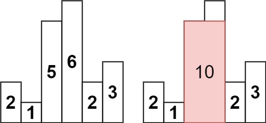

# 20. 有效的括号
> https://leetcode.cn/problems/valid-parentheses/description/?envType=study-plan-v2&envId=top-100-liked
> 
> 难度：简单
## 题目：
给定一个只包括 '('，')'，'{'，'}'，'['，']' 的字符串 s ，判断字符串是否有效。

有效字符串需满足：

左括号必须用相同类型的右括号闭合。
左括号必须以正确的顺序闭合。
每个右括号都有一个对应的相同类型的左括号。


## 示例：
输入：s = "()[]{}"
输出：true


## 分析：

如果是左括号就入栈对应的右括号，如果是右括号并且和stk不空而且与第一个相等就pop
最后判断stk是否空


## 解题1：
``` c++ 
class Solution {
public:
    bool isValid(string s) {
        if (s.size() % 2 != 0) return false; // 如果s的长度为奇数，一定不符合要求
        stack<char> st;
        for (int i = 0; i < s.size(); i++) {
            if (s[i] == '(') st.push(')');
            else if (s[i] == '{') st.push('}');
            else if (s[i] == '[') st.push(']');
            // 第三种情况：遍历字符串匹配的过程中，栈已经为空了，没有匹配的字符了，说明右括号没有找到对应的左括号 return false
            // 第二种情况：遍历字符串匹配的过程中，发现栈里没有我们要匹配的字符。所以return false
            else if (st.empty() || st.top() != s[i]) return false;
            else st.pop(); // st.top() 与 s[i]相等，栈弹出元素
        }
        // 第一种情况：此时我们已经遍历完了字符串，但是栈不为空，说明有相应的左括号没有右括号来匹配，所以return false，否则就return true
        return st.empty();
    }
};


```

# 155. 最小栈
> https://leetcode.cn/problems/min-stack/description/?envType=study-plan-v2&envId=top-100-liked
> 
> 难度：中等
## 题目：
设计一个支持 push ，pop ，top 操作，并能在常数时间内检索到最小元素的栈。

实现 MinStack 类:

MinStack() 初始化堆栈对象。
void push(int val) 将元素val推入堆栈。
void pop() 删除堆栈顶部的元素。
int top() 获取堆栈顶部的元素。
int getMin() 获取堆栈中的最小元素。


## 示例：
MinStack minStack = new MinStack();
minStack.push(-2);
minStack.push(0);
minStack.push(-3);
minStack.getMin();   --> 返回 -3.
minStack.pop();
minStack.top();      --> 返回 0.
minStack.getMin();   --> 返回 -2.


## 分析：
搞两个栈，同入 同出，最小栈先入一个int max；


## 解题1：
``` c++ 
class MinStack {
    stack<int> x_stack;
    stack<int> min_stack;
public:
    MinStack() {
        min_stack.push(INT_MAX);
    }
    
    void push(int x) {
        x_stack.push(x);
        min_stack.push(min(min_stack.top(), x));
    }
    
    void pop() {
        x_stack.pop();
        min_stack.pop();
    }
    
    int top() {
        return x_stack.top();
    }
    
    int getMin() {
        return min_stack.top();
    }
};
```

# 739. 每日温度
> https://leetcode.cn/problems/daily-temperatures/description/?envType=study-plan-v2&envId=top-100-liked
> 
> 难度：中等
## 题目：
给定一个整数数组 temperatures ，表示每天的温度，返回一个数组 answer ，其中 answer[i] 是指对于第 i 天，下一个更高温度出现在几天后。如果气温在这之后都不会升高，请在该位置用 0 来代替。


## 示例：
输入: temperatures = [73,74,75,71,69,72,76,73]
输出: [1,1,4,2,1,1,0,0]


## 分析：
分三种情况
情况一：当前遍历的元素T[i]小于栈顶元素T[st.top()]的情况 入栈
情况二：当前遍历的元素T[i]等于栈顶元素T[st.top()]的情况 入栈
情况三：当前遍历的元素T[i]大于栈顶元素T[st.top()]的情况 pop所有比T[i]小的元素 然后入栈
result[st.top()] = i - st.top();

## 解题1：
``` c++ 
class Solution {
public:
    vector<int> dailyTemperatures(vector<int>& T) {
        // 递增栈
        stack<int> st;
        vector<int> result(T.size(), 0);
        st.push(0);
        for (int i = 1; i < T.size(); i++) {
            if (T[i] < T[st.top()]) {                       // 情况一
                st.push(i);
            } else if (T[i] == T[st.top()]) {               // 情况二
                st.push(i);
            } else {
                while (!st.empty() && T[i] > T[st.top()]) { // 情况三
                    result[st.top()] = i - st.top();
                    st.pop();
                }
                st.push(i);
            }
        }
        return result;
    }
};
```

# 42. 接雨水
> https://leetcode.cn/problems/trapping-rain-water/description/
> 
> 难度：困难
## 题目：
给定 n 个非负整数表示每个宽度为 1 的柱子的高度图，计算按此排列的柱子，下雨之后能接多少雨水。


## 示例：

输入：height = [0,1,0,2,1,0,1,3,2,1,2,1]
输出：6
解释：上面是由数组 [0,1,0,2,1,0,1,3,2,1,2,1] 表示的高度图，在这种情况下，可以接 6 个单位的雨水（蓝色部分表示雨水）。


## 分析：
和每日温度一样 分三种情况
- 当前遍历的元素T[i]小于栈顶元素T[st.top()]的情况 入栈
- 当前遍历的元素T[i]等于栈顶元素T[st.top()]的情况 top 出栈 然后 入栈i
- 当前遍历的元素T[i]大于栈顶元素T[st.top()]的情况 
把top 出栈作为mid ，求  **h = min(height[st.top()], height[i]) - height[mid]**
**w = i - st.top() - 1** 最后别忘了push i

## 解题1：
``` c++ 
class Solution {
public:
    int trap(vector<int>& height) {
        if (height.size() <= 2) return 0; // 可以不加
        stack<int> st; // 存着下标，计算的时候用下标对应的柱子高度
        st.push(0);
        int sum = 0;
        for (int i = 1; i < height.size(); i++) {
            if (height[i] < height[st.top()]) {     // 情况一
                st.push(i);
            } if (height[i] == height[st.top()]) {  // 情况二
                st.pop(); 
                st.push(i);
            } else {                                // 情况三
                while (!st.empty() && height[i] > height[st.top()]) { // 注意这里是while
                    int mid = st.top();
                    st.pop();
                    if (!st.empty()) {//注意空检查
                        int h = min(height[st.top()], height[i]) - height[mid];
                        int w = i - st.top() - 1; // 注意减一，只求中间宽度
                        sum += h * w;
                    }
                }
                st.push(i);
            }
        }
        return sum;
    }
};
```

# 84.柱状图中最大的矩形
> 
> https://leetcode.cn/problems/largest-rectangle-in-histogram/
> 难度：困难
## 题目：
给定 n 个非负整数，用来表示柱状图中各个柱子的高度。每个柱子彼此相邻，且宽度为 1 。

求在该柱状图中，能够勾勒出来的矩形的最大面积。


## 示例：


输入：heights = [2,1,5,6,2,3]
输出：10
解释：最大的矩形为图中红色区域，面积为 10
## 分析：
首先头尾插入0，然后栈按照从小到大入分三种情况 ，大于等于入栈，小于就计算大小，计算的是mid往右的最大面积。


## 解题1：
``` c++ 
class Solution {
public:
    int largestRectangleArea(vector<int>& heights) {
        int result = 0;
        stack<int> st;
        heights.insert(heights.begin(), 0); // 数组头部加入元素0
        heights.push_back(0); // 数组尾部加入元素0
        st.push(0);

        // 第一个元素已经入栈，从下标1开始
        for (int i = 1; i < heights.size(); i++) {
            if (heights[i] > heights[st.top()]) { // 情况一
                st.push(i);
            } else if (heights[i] == heights[st.top()]) { // 情况二
                st.pop(); // 这个可以加，可以不加，效果一样，思路不同
                st.push(i);
            } else { // 情况三
                while (!st.empty() && heights[i] < heights[st.top()]) { // 注意是while
                    int mid = st.top();
                    st.pop();
                    if (!st.empty()) {
                        int left = st.top();
                        int right = i;
                        int w = right - left - 1;
                        int h = heights[mid];
                        result = max(result, w * h);
                    }
                }
                st.push(i);
            }
        }
        return result;
    }
};
```

