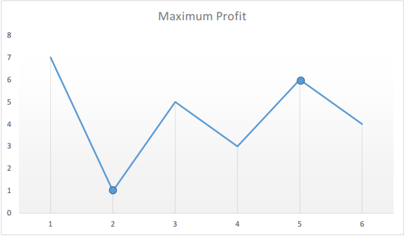
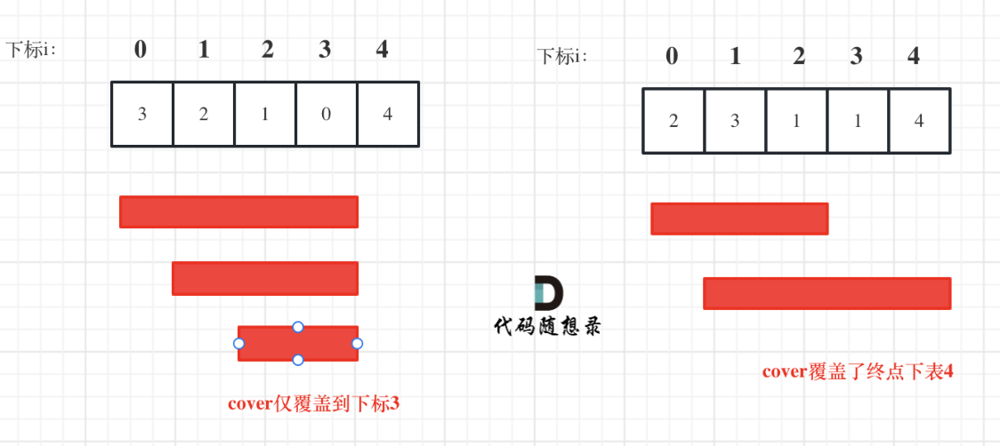
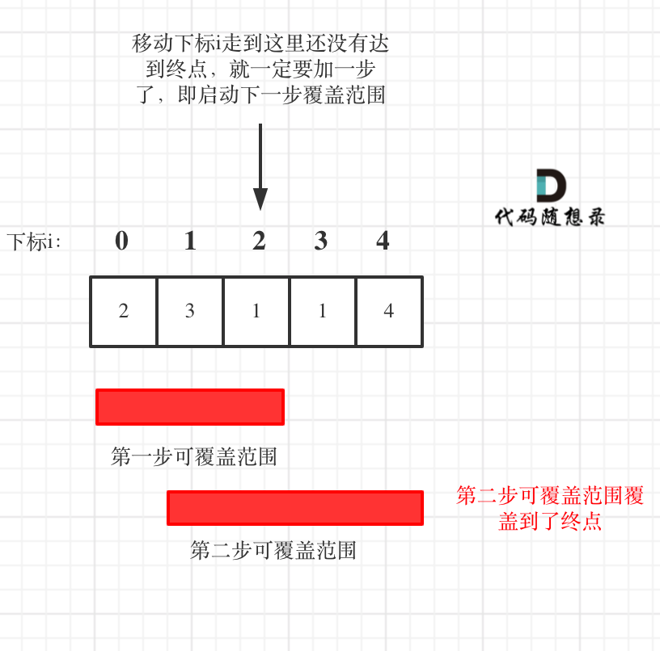
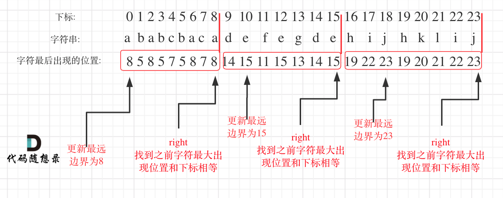

# 贪心算法
**贪心的本质是选择每一阶段的局部最优，从而达到全局最优**
贪心算法一般分为如下四步：

- 将问题分解为若干个子问题
- 找出适合的贪心策略
- 求解每一个子问题的最优解
- 将局部最优解堆叠成全局最优解
  
# 121. 买卖股票的最佳时机
> https://leetcode.cn/problems/best-time-to-buy-and-sell-stock/description/?envType=study-plan-v2&envId=top-100-liked
> 
> 难度：简单
## 题目：
给定一个数组 prices ，它的第 i 个元素 prices[i] 表示一支给定股票第 i 天的价格。

你只能选择 某一天 买入这只股票，并选择在 未来的某一个不同的日子 卖出该股票。设计一个算法来计算你所能获取的最大利润。

返回你可以从这笔交易中获取的最大利润。如果你不能获取任何利润，返回 0 。

 


## 示例：

输入：[7,1,5,3,6,4]
输出：5
解释：在第 2 天（股票价格 = 1）的时候买入，在第 5 天（股票价格 = 6）的时候卖出，最大利润 = 6-1 = 5 。
     注意利润不能是 7-1 = 6, 因为卖出价格需要大于买入价格；同时，你不能在买入前卖出股票。

## 分析：
局部最优到全局最优，只要思考遍历过的最小值和当前的差价，遍历完数组就得出结论。
因此，我们只需要遍历价格数组一遍，记录历史最低点，然后在每一天考虑这么一个问题：如果我是在历史最低点买进的，那么我今天卖出能赚多少钱？当考虑完所有天数之时，我们就得到了最好的答案。


## 解题1：
``` c++ 
class Solution {
public:
    int maxProfit(vector<int>& prices) {
        int minPrice = INT_MAX,maxPrice = 0;
        for(int price:prices){
            maxPrice = max(maxPrice,price-minPrice);
            minPrice = min(minPrice,price);
        }
        return maxPrice;
    }
};
```

# 55. 跳跃游戏
> https://leetcode.cn/problems/jump-game/description/?envType=study-plan-v2&envId=top-100-liked
> 
> 难度：中等
## 题目：
给你一个非负整数数组 nums ，你最初位于数组的 第一个下标 。数组中的每个元素代表你在该位置可以跳跃的最大长度。

判断你是否能够到达最后一个下标，如果可以，返回 true ；否则，返回 false 。


## 示例：
输入：nums = [2,3,1,1,4]
输出：true
解释：可以先跳 1 步，从下标 0 到达下标 1, 然后再从下标 1 跳 3 步到达最后一个下标。


## 分析：
贪心算法局部最优解：每次取最大跳跃步数（取最大覆盖范围），整体最优解：最后得到整体最大覆盖范围，看是否能到终点。



## 解题1：
``` c++ 
class Solution {
public:
    bool canJump(vector<int>& nums) {
        int cover = 0;
        if (nums.size() == 1) return true; // 只有一个元素，就是能达到 可以不写
        for (int i = 0; i <= cover; i++) { // 注意这里是小于等于cover
            cover = max(i + nums[i], cover);
            if (cover >= nums.size() - 1) return true; // 说明可以覆盖到终点了
        }
        return false;
    }
};

```

# 45. 跳跃游戏 II
> https://leetcode.cn/problems/jump-game-ii/description/?envType=study-plan-v2&envId=top-100-liked
> 
> 难度：中等
## 题目：
给定一个长度为 n 的 0 索引整数数组 nums。初始位置为 nums[0]。

每个元素 nums[i] 表示从索引 i 向前跳转的最大长度。换句话说，如果你在 nums[i] 处，你可以跳转到任意 nums[i + j] 处:

0 <= j <= nums[i] 
i + j < n
返回到达 nums[n - 1] 的最小跳跃次数。生成的测试用例可以到达 nums[n - 1]。


## 示例：
输入: nums = [2,3,1,1,4]
输出: 2
解释: 跳到最后一个位置的最小跳跃数是 2。
     从下标为 0 跳到下标为 1 的位置，跳 1 步，然后跳 3 步到达数组的最后一个位置。


## 分析：
用当前覆盖范围 ，和下一步覆盖范围，来计算



## 解题1：
``` c++ 
class Solution {
public:
    int jump(vector<int>& nums) {
        int nowCover =0,nextCover =0;
        int step = 0;
        if(nums.size()==1) return 0;
        for(int i=0;i<nums.size();i++){
            nextCover = max(nextCover,i+nums[i]);
            if(i==nowCover){//当前走完
                step++;
                nowCover = nextCover;
                if(nextCover>=nums.size()-1)//下一步就是终点
                    break;
            }
        }
        return step;
    }
};
```

# 763.划分字母区间
> 
> https://leetcode.cn/problems/partition-labels/
> 难度：中等
## 题目：
字符串 S 由小写字母组成。我们要把这个字符串划分为尽可能多的片段，同一字母最多出现在一个片段中。返回一个表示每个字符串片段的长度的列表。


## 示例：
输入：S = "ababcbacadefegdehijhklij"
输出：[9,7,8] 解释： 划分结果为 "ababcbaca", "defegde", "hijhklij"。 每个字母最多出现在一个片段中。 像 "ababcbacadefegde", "hijhklij" 的划分是错误的，因为划分的片段数较少。


## 分析：
- 统计每一个字符最后出现的位置
- 从头遍历字符，并更新字符的最远出现下标，如果找到字符最远出现位置下标和当前下标相等了，则找到了分割点
  
不太像贪心
  
  


## 解题1：
``` c++ 
class Solution {
public:
    vector<int> partitionLabels(string S) {
        int hash[27] = {0}; // i为字符，hash[i]为字符出现的最后位置
        for (int i = 0; i < S.size(); i++) { // 统计每一个字符最后出现的位置
            hash[S[i] - 'a'] = i;
        }
        vector<int> result;
        int left = 0;
        int right = 0;
        for (int i = 0; i < S.size(); i++) {
            right = max(right, hash[S[i] - 'a']); // 找到字符出现的最远边界
            if (i == right) {
                result.push_back(right - left + 1);
                left = i + 1;
            }
        }
        return result;
    }
};
```
