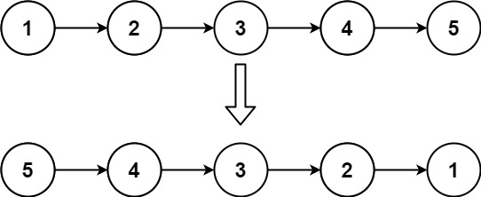

# 206. 反转链表
> https://leetcode.cn/problems/reverse-linked-list/description/?envType=study-plan-v2&envId=top-100-liked
> 
> 难度：简单
## 题目：
给你单链表的头节点 head ，请你反转链表，并返回反转后的链表。
 


## 示例：
输入：head = [1,2,3,4,5]
输出：[5,4,3,2,1]


## 分析：

设置三个指针，分别指向当前节点、前一个节点、后一个节点，然后依次修改指针指向即可

## 解题1：
``` c++ 
 class Solution {
public:
    ListNode* reverseList(ListNode* head) {
        ListNode *temp,*cur,*pre;
        pre = nullptr;
        cur = head;

        while(cur!=nullptr){
            temp = cur->next;
            cur->next = pre;

            pre = cur;
            cur = temp;
        }

        return pre;
    }
};
```

# 160. 相交链表

> https://leetcode.cn/problems/intersection-of-two-linked-lists/description/?envType=study-plan-v2&envId=top-100-liked
> 
> 难度：简单
## 题目：
给你两个单链表的头节点 headA 和 headB ，请你找出并返回两个单链表相交的起始节点。如果两个链表不存在相交节点，返回 null 。

图示两个链表在节点 c1 开始相交：


## 示例：


输入：intersectVal = 8, listA = [4,1,8,4,5], listB = [5,6,1,8,4,5], skipA = 2, skipB = 3

输出：Intersected at '8'

解释：相交节点的值为 8 （注意，如果两个链表相交则不能为 0）。
从各自的表头开始算起，链表 A 为 [4,1,8,4,5]，链表 B 为 [5,6,1,8,4,5]。
在 A 中，相交节点前有 2 个节点；在 B 中，相交节点前有 3 个节点。
— 请注意相交节点的值不为 1，因为在链表 A 和链表 B 之中值为 1 的节点 (A 中第二个节点和 B 中第三个节点) 是不同的节点。换句话说，它们在内存中指向两个不同的位置，而链表 A 和链表 B 中值为 8 的节点 (A 中第三个节点，B 中第四个节点) 在内存中指向相同的位置。

## 分析：

末尾对齐从短的开始遍历


## 解题1：
``` c++ 
class Solution {
public:


    ListNode *getIntersectionNode(ListNode *headA, ListNode *headB) {
        int numA =0,numB =0;

        ListNode *cur = headA;
        while(cur!=nullptr){
            numA++;
            cur = cur->next;
        }
        cur = headB;
        while(cur!=nullptr){
            numB++;
            cur = cur->next;
        }
        if(numB>numA){
            swap(numA,numB);
            swap(headA,headB);
        }        
        int diff = numA -numB;
            while(diff--){
                headA = headA->next;
            }

        while(headA!=nullptr){
            if(headA==headB)
                return headA;
            headA = headA->next;
            headB = headB->next;
        }

        return nullptr;
    }
};
```

# 234. 回文链表
>
> https://leetcode.cn/problems/palindrome-linked-list/?envType=study-plan-v2&envId=top-100-liked
> 
> 难度：简单
## 题目：
给你一个单链表的头节点 head ，请你判断该链表是否为回文链表。如果是，返回 true 否则，返回 false 。


## 示例：


输入：head = [1,2,2,1]
输出：true
## 分析：

用快慢指针找到中间点，在遍历快慢指针的时候顺便反转链表，然后直接对比就行，注意奇数偶数。

## 解题1：
``` c++ 
class Solution {
public:
    bool isPalindrome(ListNode* head) {
        if(!head || !head->next)
            return 1;
        ListNode *fast = head, *slow = head;
        ListNode *p, *pre = NULL;
        while(fast && fast->next){
            p = slow;
            slow = slow->next;    //快慢遍历
            fast = fast->next->next;

            p->next = pre;  //翻转
            pre = p;
        }
        if(fast)  //奇数个节点时跳过中间节点
            slow = slow->next;

        while(p){       //前半部分和后半部分比较
            if(p->val != slow->val)
                return 0;
            p = p->next;
            slow = slow->next;
        }
        return 1;
    }
};

```

# 141. 环形链表
> https://leetcode.cn/problems/linked-list-cycle/description/?envType=study-plan-v2&envId=top-100-liked
> 
> 难度：简单
## 题目：
给你一个链表的头节点 head ，判断链表中是否有环。

如果链表中有某个节点，可以通过连续跟踪 next 指针再次到达，则链表中存在环。 为了表示给定链表中的环，评测系统内部使用整数 pos 来表示链表尾连接到链表中的位置（索引从 0 开始）。注意：pos 不作为参数进行传递 。仅仅是为了标识链表的实际情况。

如果链表中存在环 ，则返回 true 。 否则，返回 false 。


## 示例：


输入：head = [3,2,0,-4], pos = 1
输出：true
解释：链表中有一个环，其尾部连接到第二个节点。
## 分析：
快慢指针如果相遇就有环

## 解题1：
``` c++ 
class Solution {
public:
    bool hasCycle(ListNode *head) {
        if(head ==nullptr)
            return false;
        ListNode *fast,*slow;
        fast = head;
        slow = head;
        while(fast->next!=nullptr&&fast->next->next!=nullptr){
            slow = slow->next;
            fast = fast->next->next;
            if(slow == fast)
                return true;
        }
        return false;
    }
};
```


# 142. 环形链表 II
> https://leetcode.cn/problems/linked-list-cycle-ii/description/?envType=study-plan-v2&envId=top-100-liked
> 
> 难度：中等
## 题目：
给定一个链表的头节点  head ，返回链表开始入环的第一个节点。 如果链表无环，则返回 null。

如果链表中有某个节点，可以通过连续跟踪 next 指针再次到达，则链表中存在环。 为了表示给定链表中的环，评测系统内部使用整数 pos 来表示链表尾连接到链表中的位置（索引从 0 开始）。如果 pos 是 -1，则在该链表中没有环。注意：pos 不作为参数进行传递，仅仅是为了标识链表的实际情况。

不允许修改 链表。

## 示例：


输入：head = [3,2,0,-4], pos = 1
输出：返回索引为 1 的链表节点
解释：链表中有一个环，其尾部连接到第二个节点。
## 分析：
快慢指针，在第一次相遇后构建第二次相遇，第二次相遇点就是入口

再一次相遇是走了一个b的长度

第二次是走了一个入口的长度


## 解题1：
``` c++ 
class Solution {
public:
    ListNode *detectCycle(ListNode *head) {
        ListNode *fast = head;
        ListNode *slow = head;
        while(fast!=nullptr&& fast->next != nullptr){
            slow = slow->next;
            fast = fast->next->next;
            if(slow == fast){
                ListNode *ind1 = fast;
                ListNode *ind2 = head;

                while(ind1 != ind2){
                    ind1 = ind1->next;
                    ind2 = ind2->next;
                }
                return ind2;
            }
        }
        return NULL;
    }
};
```

# 21. 合并两个有序链表
> 
> https://leetcode.cn/problems/merge-two-sorted-lists/description/?envType=study-plan-v2&envId=top-100-liked
> 难度：简单
## 题目：
将两个升序链表合并为一个新的 升序 链表并返回。新链表是通过拼接给定的两个链表的所有节点组成的。 


## 示例：

输入：l1 = [1,2,4], l2 = [1,3,4]
输出：[1,1,2,3,4,4]

## 分析：
递归 注意递归三部曲 可以参考二叉树递归


## 解题1：
``` c++ 
class Solution {
public:
    ListNode* mergeTwoLists(ListNode* list1, ListNode* list2) {
        if(list1 ==nullptr)
            return list2;
        if(list2 ==nullptr)
            return list1;
        if(list1->val>list2->val){
            list2->next = mergeTwoLists(list1,list2->next);
                return list2;}
        else{
            list1->next = mergeTwoLists(list1->next,list2);
                return list1;}

    }
};
```

# 2. 两数相加
> https://leetcode.cn/problems/add-two-numbers/description/?envType=study-plan-v2&envId=top-100-liked
> 
> 难度：中等
## 题目：
给你两个 非空 的链表，表示两个非负的整数。它们每位数字都是按照 逆序 的方式存储的，并且每个节点只能存储 一位 数字。

请你将两个数相加，并以相同形式返回一个表示和的链表。

你可以假设除了数字 0 之外，这两个数都不会以 0 开头。


## 示例：


输入：l1 = [2,4,3], l2 = [5,6,4]
输出：[7,0,8]
解释：342 + 465 = 807.
## 分析：
我们同时遍历两个链表，逐位计算它们的和，并与当前位置的进位值相加。具体而言，如果当前两个链表处相应位置的数字为 n1,n2，进位值为 carry，则它们的和为 n1+n2+carry；其中，答案链表处相应位置的数字为 (n1+n2+carry) mod 10
，而新的进位值为 (n1+n2+carry) / 10。

如果两个链表的长度不同，则可以认为长度短的链表的后面有若干个 000 。

此外，如果链表遍历结束后，有 carry>0，还需要在答案链表的后面附加一个节点，节点的值为 carry。


## 解题1：
``` c++ 
class Solution {
public:
    ListNode* addTwoNumbers(ListNode* l1, ListNode* l2) {
        ListNode *head =nullptr, *tail =nullptr;
        int carry =0;
        while(l1||l2){
            int n1 = l1?l1->val:0;
            int n2 = l2?l2->val:0;
            int sum = n1 + n2 + carry;
            if(!head){
                head = tail = new ListNode(sum%10);
            }else{
                tail ->next = new ListNode(sum%10);
                tail = tail->next;
            }
            carry = sum/10;
            if(l1){
                l1=l1->next;
            }
            if(l2){
                l2=l2->next;
            }
        }
        if(carry>0){
                tail->next = new ListNode(carry);
            }
        return head;

    }
};
```

# 19. 删除链表的倒数第 N 个结点
> https://leetcode.cn/problems/remove-nth-node-from-end-of-list/description/?envType=study-plan-v2&envId=top-100-liked
> 
> 难度：中等
## 题目：
给你一个链表，删除链表的倒数第 n 个结点，并且返回链表的头结点。


## 示例：

输入：head = [1,2,3,4,5], n = 2
输出：[1,2,3,5]

## 分析：
双指针的经典应用，如果要删除倒数第n个节点，让fast移动n+1步，然后让fast和slow同时移动，直到fast指向链表末尾。这时候slow指向要删除的前一个节点，删掉slow后面所指向的节点就可以了。别忘了注意细节和虚拟头节点。

## 解题1：
``` c++ 
class Solution {
public:
    ListNode* removeNthFromEnd(ListNode* head, int n) {
        ListNode *fast,*slow;
        ListNode* summyNode = new ListNode(0);
        fast = summyNode;
        slow = summyNode;
        summyNode ->next = head;
        n++;
        while(n--&&fast != nullptr){
            fast = fast->next;
        }

        while(fast != nullptr){
            slow = slow->next;
            fast = fast->next;
        }
        ListNode *temp = slow->next;
        slow->next = slow->next->next;

        delete temp;
        
        return summyNode->next;
    }
};
```

# 24. 两两交换链表中的节点
> 
> https://leetcode.cn/problems/swap-nodes-in-pairs/description/?envType=study-plan-v2&envId=top-100-liked
> 难度：简单
## 题目：
给你一个链表，两两交换其中相邻的节点，并返回交换后链表的头节点。你必须在不修改节点内部的值的情况下完成本题（即，只能进行节点交换）。


## 示例：

输入：head = [1,2,3,4]
输出：[2,1,4,3]

## 分析：
看图


## 解题1：
``` c++ 
class Solution {
public:
    ListNode* swapPairs(ListNode* head) {
        ListNode* dummyHead = new ListNode(0); // 设置一个虚拟头结点
        dummyHead->next = head; // 将虚拟头结点指向head，这样方便后面做删除操作
        ListNode* cur = dummyHead;
        while(cur->next != nullptr && cur->next->next != nullptr) {
            ListNode* tmp = cur->next; // 记录临时节点
            ListNode* tmp1 = cur->next->next->next; // 记录临时节点

            cur->next = cur->next->next;    // 步骤一
            cur->next->next = tmp;          // 步骤二
            cur->next->next->next = tmp1;   // 步骤三

            cur = cur->next->next; // cur移动两位，准备下一轮交换
        }
        return dummyHead->next;
    }
};
```

# 25. K 个一组翻转链表
> https://leetcode.cn/problems/reverse-nodes-in-k-group/description/?envType=study-plan-v2&envId=top-100-liked
> 
> 难度：困难
## 题目：
给你链表的头节点 head ，每 k 个节点一组进行翻转，请你返回修改后的链表。

k 是一个正整数，它的值小于或等于链表的长度。如果节点总数不是 k 的整数倍，那么请将最后剩余的节点保持原有顺序。

你不能只是单纯的改变节点内部的值，而是需要实际进行节点交换。


## 示例：

输入：head = [1,2,3,4,5], k = 2
输出：[2,1,4,3,5]

## 分析：
分为两步，第一步根据头尾节点，反转链表。一段段遍历就行


## 解题1：
``` c++ 
class Solution {
public:

    pair<ListNode*,ListNode*> reserveNode(ListNode *head,ListNode *tail){
        ListNode *cur = head;
        ListNode *pre = tail->next;
        while(pre != tail){
            ListNode*temp = cur->next;
            cur->next = pre;
            
            pre = cur;
            cur = temp;

        }
        
        return {tail,head};
    }

    ListNode* reverseKGroup(ListNode* head, int k) {
        ListNode *dummyHead = new ListNode(0);
        dummyHead->next  = head;
        ListNode *cur = dummyHead;
        ListNode *pre = dummyHead;
        ListNode *end = nullptr;
        
        while(head!=nullptr){
            for(int i=0;i<k;i++){
                cur=cur->next;
                if(cur==nullptr)
                    return dummyHead->next;
                
            }
            end = cur->next;
            pair<ListNode*,ListNode*> result = reserveNode(pre->next,cur);

            //接上去
            pre->next = result.first;
            result.second->next= end;

            pre = result.second;
            cur =pre;
        }

        return dummyHead->next;
        
    }
};
```

# 138. 随机链表的复制
> https://leetcode.cn/problems/copy-list-with-random-pointer/description/?envType=study-plan-v2&envId=top-100-liked
> 
> 难度：中等
## 题目：
给你一个长度为 n 的链表，每个节点包含一个额外增加的随机指针 random ，该指针可以指向链表中的任何节点或空节点。

构造这个链表的 深拷贝。 深拷贝应该正好由 n 个 全新 节点组成，其中每个新节点的值都设为其对应的原节点的值。新节点的 next 指针和 random 指针也都应指向复制链表中的新节点，并使原链表和复制链表中的这些指针能够表示相同的链表状态。复制链表中的指针都不应指向原链表中的节点 。


## 示例：

输入：head = [[7,null],[13,0],[11,4],[10,2],[1,0]]
输出：[[7,null],[13,0],[11,4],[10,2],[1,0]]

## 分析：
利用哈希表的查询特点，考虑构建 原链表节点 和 新链表对应节点 的键值对映射关系，再遍历构建新链表各节点的 next 和 random 引用指向即可。


## 解题1：
``` c++ 
class Solution {
public:
    Node* copyRandomList(Node* head) {

        if(head==nullptr)
            return nullptr;
        Node* oldNode ;
        oldNode = head;
        unordered_map<Node* ,Node* > map ;
        while(oldNode!=nullptr){
            map.insert({ oldNode,new Node(oldNode->val)});
            oldNode = oldNode->next;
        }
        oldNode = head;
        while(oldNode!=nullptr){
            map[oldNode]->next = map[oldNode->next];
            map[oldNode]->random = map[oldNode->random];
            oldNode = oldNode->next;
        }
        return map[head];
    }
};
```

# 23. 合并 K 个升序链表
> https://leetcode.cn/problems/merge-k-sorted-lists/description/?envType=study-plan-v2&envId=top-100-liked
> 
> 难度：困难
## 题目：

给你一个链表数组，每个链表都已经按升序排列。

请你将所有链表合并到一个升序链表中，返回合并后的链表。

## 示例：
输入：lists = [[1,4,5],[1,3,4],[2,6]]
输出：[1,1,2,3,4,4,5,6]
解释：链表数组如下：
[
  1->4->5,
  1->3->4,
  2->6
]
将它们合并到一个有序链表中得到。
1->1->2->3->4->4->5->6


## 分析：

就是结合一下合并有序链表，顺便用分治的思想合并


## 解题1：
``` c++ 
class Solution {
public:
    ListNode* mergeTwoLists(ListNode *a, ListNode *b) {
        if ((!a) || (!b)) return a ? a : b;
        ListNode head, *tail = &head, *aPtr = a, *bPtr = b;
        while (aPtr && bPtr) {
            if (aPtr->val < bPtr->val) {
                tail->next = aPtr; aPtr = aPtr->next;
            } else {
                tail->next = bPtr; bPtr = bPtr->next;
            }
            tail = tail->next;
        }
        tail->next = (aPtr ? aPtr : bPtr);
        return head.next;
    }

    ListNode* merge(vector <ListNode*> &lists, int l, int r) {
        if (l == r) return lists[l];
        if (l > r) return nullptr;
        int mid = (l + r) >> 1;
        return mergeTwoLists(merge(lists, l, mid), merge(lists, mid + 1, r));
    }

    ListNode* mergeKLists(vector<ListNode*>& lists) {
        return merge(lists, 0, lists.size() - 1);
    }
};

```

