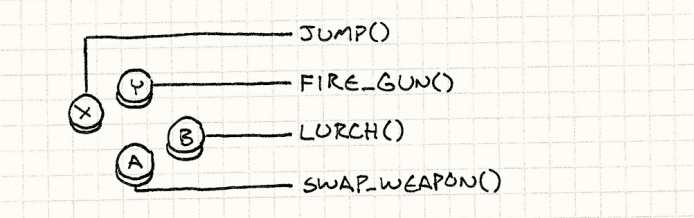
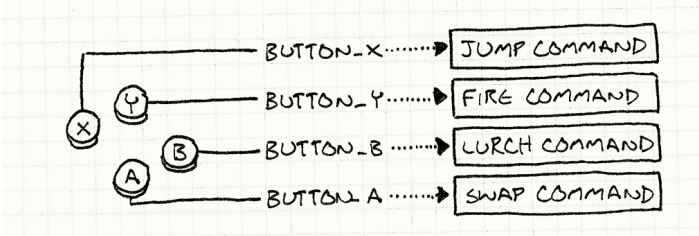
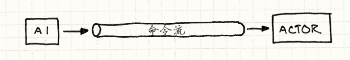
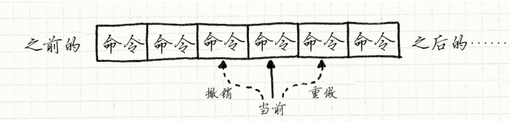

## 命令模式

### **简单实现的配置输入**
```c++
void InputHandler::handleInput()
{
 if (isPressed(BUTTON_X)) jump();
 else if (isPressed(BUTTON_Y)) fireGun();
 else if (isPressed(BUTTON_A)) swapWeapon();
 else if (isPressed(BUTTON_B)) lurchIneffectively();
}
```


### 使用命令模式
```c++
class Command
{
public:
 virtual ~Command() {}
 virtual void execute() = 0;
};


class JumpCommand : public Command
{
public:
 virtual void execute() { jump(); }
};
class FireCommand : public Command
{
public:
 virtual void execute() { fireGun(); }
};


class InputHandler
{
public:
 void handleInput();
 // 绑定命令的方式
private:
 Command* buttonX_;
 Command* buttonY_;
 Command* buttonA_;
 Command* buttonB_;
};

void InputHandler::handleInput()
{
 if (isPressed(BUTTON_X)) buttonX_->execute();
 else if (isPressed(BUTTON_Y)) buttonY_->execute();
 else if (isPressed(BUTTON_A)) buttonA_->execute();
 else if (isPressed(BUTTON_B)) buttonB_->execute();
}

```
**现在出现一个间接寻址**

### 改进

```c++
class Command
{
public:
 virtual ~Command() {}
 virtual void execute(GameActor& actor) = 0;
};

//更加通用 不在局限于player
class JumpCommand : public Command
{
public:
 virtual void execute(GameActor& actor)
 {
 actor.jump();
 }
};

//不能立刻执行 因为还不知道什么角色会传过来 
Command* InputHandler::handleInput()
{
 if (isPressed(BUTTON_X)) return buttonX_;
 if (isPressed(BUTTON_Y)) return buttonY_;
 if (isPressed(BUTTON_A)) return buttonA_;
 if (isPressed(BUTTON_B)) return buttonB_;

 return NULL;
}

//真正运行起来样子
Command* command = inputHandler.handleInput();
if (command)
{
 command->execute(actor);
}
```
**那么现在我们可以控制所有角色，只要向命令行传入不同角色**
### 命令流 撤销与重做


可能的移动代码 长这样
```c++
class MoveUnitCommand : public Command
{
public:
 MoveUnitCommand(Unit* unit, int x, int y)
 : unit_(unit),
 x_(x),
 y_(y)
 {}
 virtual void execute()
 {
 unit_->moveTo(x_, y_);
 }
private:
 Unit* unit_;
 int x_, y_;
};
```
**命令调用**
```c++

Command* handleInput()
{
 Unit* unit = getSelectedUnit();
 if (isPressed(BUTTON_UP)) {

 int destY = unit->y() - 1;
 return new MoveUnitCommand(unit, unit->x(), destY);
 }
 if (isPressed(BUTTON_DOWN)) {

 int destY = unit->y() + 1;
 return new MoveUnitCommand(unit, unit->x(), destY);
 }

 return NULL;
}

```
为了让命令可撤销需要更改基类
```c++
class Command
{
public:
 virtual ~Command() {}
 virtual void execute() = 0;
 virtual void undo() = 0;
};

```

增加撤销功能后的移动命令
```c++
class MoveUnitCommand : public Command
{
public:
 MoveUnitCommand(Unit* unit, int x, int y)
 : unit_(unit),
 xBefore_(0),
 yBefore_(0),
 x_(x),
 y_(y)
 { }
 virtual void execute()
 {

    xBefore_ = unit_->x();
    yBefore_ = unit_->y();
    unit_->moveTo(x_, y_);
 }
 virtual void undo()
 {
    unit_->moveTo(xBefore_, yBefore_);
 }
private:
    Unit* unit_;
    int xBefore_, yBefore_;
    int x_, y_;
};
```
可以看到类中有了更多状态

所以以此为基础实现一个命令队列就能实现命令的撤销 重做


#### 总结
- 最终可能会有不同命令类，定义一个具体基类 然后把实现主体execute转到子类中更好
- 例子中我们明确了那个角色处理命令。在一些情况下，当对象模型分层时，对象可以响应命令，或者是把命令交给从属对象。如果这么做就完成了职责链模式。
- 其中有些命令是无状态的纯粹行为，比如第一个的jumpcommand，如果实力等价，那么就可以用享元模式。

## 享元模式
